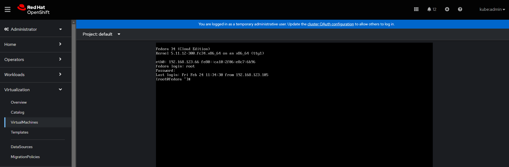
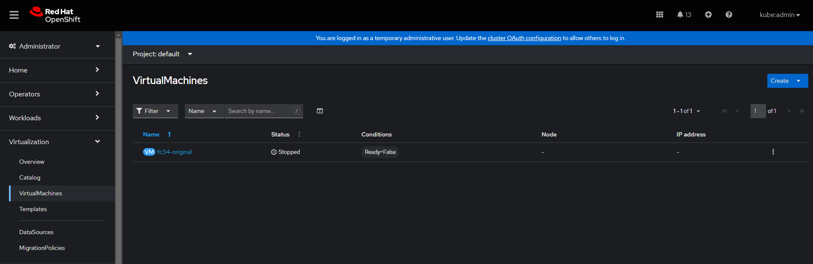
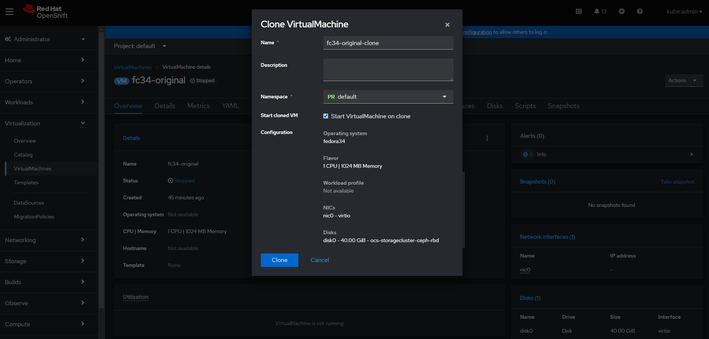

In this lab we're going to clone a workload and see that it's identical to the source of the clone. To do this we'll complete the following steps:

- Download and customise a Fedora 34 image
- Launch it as a virtual machine via OpenShift Virtualization 
- Install a basic application inside the VM
- Clone the VM
- Test the clone to make sure it's identical to the source

Before we begin we need to setup our Fedora 34 cloud image, let's first connect to our bastion host so we can process and serve the image from there. First ssh to bastion node (password is *%cnvlab-bastion-password%*):

```execute-1
ssh %bastion-username%@%bastion-host%
```


Change directory to `/var/www/html` where we'll serve the image from via Apache:

```execute-1
cd /var/www/html
```

Download the latest Fedora 34 cloud image to this directory:

```execute-1
wget http://mirror.uv.es/mirror/fedora/linux/releases/34/Cloud/x86_64/images/%cloud-image-name-fedora%.xz
```

Wait for the download to complete and extract/decompress the image:


```execute-1
xz -d %cloud-image-name-fedora%.xz
```
> **NOTE**: You will not see any output, but it may take a minute to complete.


Check the cloud image file:

```execute-1
ls -l | grep -i fedora
```

It should show the following:

~~~bash
-rw-r--r--. 1 root root  5368709120 Mar 3  2023 %cloud-image-name-fedora%
~~~

Now we need to customise this image. We're going to do the following:

* Permit root login over ssh
* Reset the root password to a secure one


Install libguestfs-tools so we can modify the image:

```execute-1
dnf install libguestfs-tools -y
```

Enable libvirtd service as it's a dependency for libguestfs:

```execute-1
systemctl enable --now libvirtd
```

Now we're ready to customise the downloaded image. First we enable ssh logins for root and mark the system for an SELinux relabel:

```execute-1
virt-customize -a /var/www/html/%cloud-image-name-fedora% --run-command 'sed -i s/^#PermitRootLogin.*/PermitRootLogin\ yes/ /etc/ssh/sshd_config && touch /.autorelabel'
```

Then remove cloud-init (as we don't need it during this lab) and **set the root password** to something secure:

```copy-and-edit
virt-customize -a /var/www/html/%cloud-image-name-fedora% --uninstall=cloud-init --root-password password:<set plaintext secure password here> --ssh-inject root:file:/root/.ssh/id_rsa.pub
```

Then exit from the bastion host:

```execute-1
exit
```
Execute `oc whoami` here just makes sure you're in the right place:

```execute-1
oc whoami
```

As before, make sure you're in the *cnv* service account:

~~~bash
system:serviceaccount:workbook:cnv
~~~


> **NOTE**: Make sure that you've disconnected from the bastion machine before proceeding.

Now that we've prepared our Fedora 34 VM and placed it on an accessible location on our bastion host (for reference it's at: http://%bastion-host%:81/%cloud-image-name-fedora%), let's build a PVC for this image, allowing us to build a VM from it afterwards, **one that will become our "original" or "source" virtual machine for cloning purposes**. First, make sure you're in the default project:

```execute-1
oc project default
```

You should see:

~~~bash
Now using project "default" on server "https://172.30.0.1:443".
~~~

Again we'll utilise the CDI utility to get the Fedora image from the endpoint we placed it on:

```execute-1
cat << EOF | oc apply -f -
apiVersion: v1
kind: PersistentVolumeClaim
metadata:
  name: "fc34-original"
  labels:
    app: containerized-data-importer
  annotations:
    cdi.kubevirt.io/storage.import.endpoint: "http://192.168.123.100:81/%cloud-image-name-fedora%"
spec:
  volumeMode: Block
  storageClassName: ocs-storagecluster-ceph-rbd
  accessModes:
  - ReadWriteMany
  resources:
    requests:
      storage: 40Gi
EOF
```
And PVC should be created:

~~~bash
persistentvolumeclaim/fc34-original created
~~~

Now check the PVC:

```execute-1
oc get pvc
```

And make sure the claim is `Bound` and has a matching volume:

~~~bash
NAME            STATUS   VOLUME                                     CAPACITY   ACCESS MODES   STORAGECLASS                  AGE
fc34-original   Bound    pvc-ebc89d26-13f1-45e4-82d1-be665982df36   40Gi       RWX            ocs-storagecluster-ceph-rbd   27s
~~~

As before, we can watch the process and see the pods. You'll need to be quick with the next two commands, as it's only a 10GB image:

```execute-1
oc get pod/importer-fc34-original
```

The pod should be running after a few seconds:

~~~bash
NAME                     READY   STATUS    RESTARTS   AGE
importer-fc34-original   1/1     Running   0          21s
~~~

Follow the importer logs:

```execute-1
oc logs importer-fc34-original -f
```

You should see an output similar to below, showing import progress:

~~~bash
I0319 02:41:06.647561       1 importer.go:51] Starting importer
I0319 02:41:06.651389       1 importer.go:107] begin import process
I0319 02:41:06.654768       1 data-processor.go:275] Calculating available size
I0319 02:41:06.656489       1 data-processor.go:283] Checking out file system volume size.
I0319 02:41:06.656689       1 data-processor.go:287] Request image size not empty.
I0319 02:41:06.656704       1 data-processor.go:292] Target size 10Gi.
I0319 02:41:06.657272       1 data-processor.go:205] New phase: TransferDataFile
I0319 02:41:06.660080       1 util.go:170] Writing data...
I0319 02:41:07.657584       1 prometheus.go:69] 17.53
I0319 02:41:08.657711       1 prometheus.go:69] 17.53
I0319 02:41:09.678442       1 prometheus.go:69] 24.25
~~~

Ctrl-C to exit, or just wait for it to finish. We've also included a stripped down importer description below, noting that it's unlikely that you'll be able to execute this command unless you're very quick!

```execute-1
oc describe pod $(oc get pods | awk '/importer/ {print $1;}')
```

Which, if you're quick enough (the import may have already completed and the above command will fail), should show...

~~~yaml
Name:         importer-fc34-original
Namespace:    default
Priority:     0
Node:         ocp4-worker2.aio.example.com/192.168.123.105
Start Time:   Fri, 17 Feb 2023 14:32:03 +0000
Labels:       app=containerized-data-importer
              cdi.kubevirt.io=importer
              cdi.kubevirt.io/storage.import.importPvcName=fc34-original
              prometheus.cdi.kubevirt.io=
Annotations:  cdi.kubevirt.io/storage.createdByController: yes
              k8s.v1.cni.cncf.io/networks-status:
(...)
    Environment:
      IMPORTER_SOURCE:       http
      IMPORTER_ENDPOINT:     http://192.168.123.100:81/%cloud-image-name-fedora%
      IMPORTER_CONTENTTYPE:  kubevirt
      IMPORTER_IMAGE_SIZE:   10Gi
      OWNER_UID:             6cf06f28-7056-40e8-bb8b-2bac5abbe363
      INSECURE_TLS:          false
    Mounts:
      /data from cdi-data-vol (rw)
      /var/run/secrets/kubernetes.io/serviceaccount from default-token-crznj (ro)
(...)
Volumes:
  cdi-data-vol:
    Type:       PersistentVolumeClaim (a reference to a PersistentVolumeClaim in the same namespace)
    ClaimName:  fc34-original
    ReadOnly:   false
(...)
~~~


### Fedora 34 Virtual Machine

Now it's time to launch a Fedora VM based on the image we just created, that will become our original VM that we'll clone in a later step. Again we are just using the same pieces we've been using throughout the labs. For review, we are using the `fc34-original` PVC we just prepared (created with CDI importing the Fedora image, stored on ODF/OCS), and we are utilising the standard bridged networking on the workers via the `tuning-bridge-fixed` construct - the same as we've been using for the other two virtual machines we created previously:

```execute-1
cat << EOF | oc apply -f -
apiVersion: kubevirt.io/v1alpha3
kind: VirtualMachine
metadata:
  name: fc34-original
  labels:
    app: fc34-original
    os.template.kubevirt.io/fedora34: 'true'
    vm.kubevirt.io/template-namespace: openshift
    workload.template.kubevirt.io/server: 'true'
spec:
  running: true
  template:
    metadata:
      labels:
        vm.kubevirt.io/name: fc34-original
    spec:
      domain:
        cpu:
          cores: 1
          sockets: 1
          threads: 1
        devices:
          disks:
            - bootOrder: 1
              disk:
                bus: virtio
              name: disk0
          interfaces:
            - bridge: {}
              model: virtio
              name: nic0
          networkInterfaceMultiqueue: true
          rng: {}
        machine:
          type: pc-q35-rhel8.1.0
        resources:
          requests:
            memory: 1024M
      evictionStrategy: LiveMigrate
      hostname: fc34-original
      networks:
        - multus:
            networkName: tuning-bridge-fixed
          name: nic0
      terminationGracePeriodSeconds: 0
      volumes:
        - name: disk0
          persistentVolumeClaim:
            claimName: fc34-original
EOF
```

Check the VM is created:

~~~bash
virtualmachine.kubevirt.io/fc34-original created
~~~

We can view the running VM:

```execute-1
oc get vmi
```

You should see the following, noting that your IP address may be different, and may take some to show an IP address (retry this command for a few minutes):

~~~bash
NAME            AGE   PHASE     IP               NODENAME                       READY
fc34-original   81s   Running   192.168.123.65   ocp4-worker1.aio.example.com   True
~~~

> **NOTE:** The IP address for the Fedora 34 virtual machine may be missing in your output above as it takes a while for the `qemu-guest-agent` to report the data through to OpenShift. We also requested an SELinux relabel for the VM, which take some more time. You'll need to wait for the IP address to show before you can move to the next steps.

When you've got an IP address, we should be able to SSH to it from our terminal window, noting you'll need to adapt the address below to match your environment (the password is the one you've set earlier), and your IP address may **not** be the same as the example - adapt for your configuration:

```copy-and-edit
ssh root@192.168.123.65
```
> **NOTE:** It will ask for the root password you set up when we customised the downloaded image. 

The following tasks should be performed from the VM's shell:

~~~bash
[root@fedora ~]#
~~~


We're going to deploy a basic application into our Fedora-based virtual machine; let's install `nginx` via `systemd` and `podman`, i.e. have *systemd* call *podman* to start an *nginx* container at boot time, and have it display a simple web page:


First install podman:

```execute-1
dnf install podman -y
```

Then create an nginx service based on podman:

```execute-1
cat >> /etc/systemd/system/nginx.service << EOF
[Unit]
Description=Nginx Podman container
Wants=syslog.service
[Service]
ExecStart=/usr/bin/podman run --net=host quay.io/roxenham/nginxdemos:plain-text
ExecStop=/usr/bin/podman stop --all
[Install]
WantedBy=multi-user.target
EOF
```

Then enable nginx service:

```execute-1
systemctl daemon-reload && systemctl enable --now nginx
```

Which should show:

~~~bash
Created symlink /etc/systemd/system/multi-user.target.wants/nginx.service → /etc/systemd/system/nginx.service.
~~~

Check nginx service status:

```execute-1
systemctl status nginx
```

It should show the service as "active (running)":

~~~bash
● nginx.service - Nginx Podman container
   Loaded: loaded (/etc/systemd/system/nginx.service; enabled; vendor preset: disabled)
   Active: active (running) since Tue 2023-02-22 01:30:48 UTC; 8s ago
 Main PID: 9898 (podman)
    Tasks: 11 (limit: 2345)
~~~

Now logout from the VM:

```execute-1
logout
```

Ensure you are in the right host:

```execute-1
oc whoami
```

Expect to see the *cnv* service account again:

~~~bash
system:serviceaccount:workbook:cnv
~~~

Let's quickly verify that this works as expected. You should be able to navigate directly to the IP address of your machine via `curl`. You may need to adjust the IP to reflect your environment's values.


```copy-and-edit
curl http://192.168.123.65
```

~~~bash
Server address: 192.168.123.65:80
Server name: fedora
Date: 22/Feb/2023:16:25:27 +0000
URI: /
Request ID: f0cdd44266c0495fa8aab6048736978b
~~~

> **NOTE**: We've purposely installed a plain-text server-side option here as we cannot route to the 192.168.123.0/24 network via the internet. In a later step we'll change this to a visual one and we'll expose it via the OpenShift ingress service and it'll be available as a route.


Now that we know our VM is working, we need to shutdown the VM so we can clone it without risking filesystem corruption. We'll use the `virtctl` command to help us with this as it saves us logging back into the VM by interacting via the guest agent:

```execute-1
virtctl stop fc34-original
```

The VM is now scheduled to stop:

~~~bash
VM fc34-original was scheduled to stop
~~~

Next, check the list of `vm` objects. It's now marked as `Stopped`:

```execute-1
oc get vm
```

~~~bash
NAME            AGE   STATUS    READY
fc34-original   34m   Stopped   False
~~~


### Clone the VM

Now that we've got a working virtual machine with a test workload we're ready to actually clone it. This will demonstrate that the built-in cloning utilities work and that the cloned machine shares the same workload. 

There are a couple of ways of doing this, but first we'll use the CLI to do it. For this method we clone the underlying storage volume by creating a PV (persistent volume) to clone into. This is done with a special resource called a `DataVolume`. This custom resource type is provide by CDI. DataVolumes orchestrate import, clone, and upload operations and help the process of importing data into a cluster. DataVolumes are integrated into OpenShift Virtualization.

The volume we are creating is named `fc34-clone` and we'll be pulling the data from the volume ("source") `fc34-original`:


```execute-1
cat << EOF | oc apply -f -
apiVersion: cdi.kubevirt.io/v1alpha1
kind: DataVolume
metadata:
  name: fc34-clone
spec:
  source:
    pvc:
      namespace: default
      name: fc34-original
  pvc:
    volumeMode: Block
    storageClassName: ocs-storagecluster-ceph-rbd
    accessModes:
      - ReadWriteMany
    resources:
      requests:
        storage: 40Gi
EOF
```

The DataVolume is created:

~~~bash
datavolume.cdi.kubevirt.io/fc34-clone created
~~~

Usually, a clone goes through a number of stages, and you can watch the progress through `CloneScheduled` and `CloneInProgress` phases. However in our case we're using OpenShift Container Storage which makes an instant clone of a volume within the storage platform and doesn't require this process. 

You'll be able to view the status of the new PVC:

```execute-1
oc get pvc/fc34-clone
```

This should show both objects:

~~~bash
NAME            STATUS   VOLUME                                     CAPACITY   ACCESS MODES   STORAGECLASS                  AGE
fc34-clone      Bound    pvc-3c3943f9-0a5c-4ce9-a913-782f8754f418   40Gi       RWX            ocs-storagecluster-ceph-rbd   83s
~~~


### Start the cloned VM

We can now start up a new VM using the cloned PVC. First create a new definition of a `VirtualMachine` to house the VM and start it automatically (`running: true`):

```execute-1
cat << EOF | oc apply -f -
apiVersion: kubevirt.io/v1alpha3
kind: VirtualMachine
metadata:
  name: fc34-clone
  labels:
    app: fc34-clone
    os.template.kubevirt.io/fedora34: 'true'
    vm.kubevirt.io/template-namespace: openshift
    workload.template.kubevirt.io/server: 'true'
spec:
spec:
  running: true
  template:
    metadata:
      labels:
        vm.kubevirt.io/name: fc34-clone
    spec:
      domain:
        cpu:
          cores: 1
          sockets: 1
          threads: 1
        devices:
          disks:
            - bootOrder: 1
              disk:
                bus: virtio
              name: disk0
          interfaces:
            - bridge: {}
              model: virtio
              name: nic0
          networkInterfaceMultiqueue: true
          rng: {}
        machine:
          type: pc-q35-rhel8.1.0
        resources:
          requests:
            memory: 2Gi
      evictionStrategy: LiveMigrate
      hostname: fc34-clone
      networks:
        - multus:
            networkName: tuning-bridge-fixed
          name: nic0
      terminationGracePeriodSeconds: 0
      volumes:
        - name: disk0
          persistentVolumeClaim:
            claimName: fc34-clone
EOF
```

This shows the VM creation:

~~~bash
virtualmachine.kubevirt.io/fc34-clone created
~~~

After a few minutes you should see the new virtual machine running:

```execute-1
oc get vm
```

You will have one running (the clone), and one stopped (the original):

~~~bash
NAME            AGE   STATUS    READY
fc34-clone      84s   Running   True
fc34-original   76m   Stopped   False
~~~

This machine should also get an IP address after a few minutes - it won't be the same as the original VM as the clone was given a new MAC address, you may need to be patient here until it shows you the IP address of the new VM:

```execute-1
oc get vmi
```

In our example, this IP is "*192.168.123.66*":

~~~bash
NAME         AGE   PHASE     IP               NODENAME                       READY
fc34-clone   88s   Running   192.168.123.66   ocp4-worker2.aio.example.com   True
~~~

This machine will also be visible from the OpenShift Virtualization tab. Switch to the **full OpenShift console** (%cnvlab-console-url%). In case you are not logged in, use the *kubeadmin* user and the password: %cnvlab-kubeadmin-password%. Once logged in, navigate to "**Virtualization**" → "**Virtual Machines**" → "**fc34-clone**" → "**Console**". There, you can login using the "**root**" user with the password you've set earlier:



### Test the clone

Like before, we should be able to just directly connect to the VM on port 80 via `curl` and view our simple NGINX based application responding. Let's try it! Remember to use to the IP address from **your** environment as the example below may be different:

~~~copy-and-edit
curl http://192.168.123.66
~~~

Which should show similar to the following, if our clone was successful:

~~~bash
Server address: 192.168.123.66:80
Server name: fedora
Date: 22/Feb/2023:15:58:20 +0000
URI: /
Request ID: 30d16f4250df0d0d82ec2af2ebb60728
~~~

Our VM was cloned! At least the backend storage volume was cloned and we created a new virtual machine from it. Now you're probably thinking "wow, that was a lot of work just to clone a VM", and you'd be right! There's a much more simple workflow via the UI, and one that copies over all of the same configuration without us having to define a new VM ourselves. Let's first delete our clone, and then we'll move onto re-cloning the original via the UI:

```execute-1
oc delete vm/fc34-clone pvc/fc34-clone
```

This should delete all objects at the same time:

~~~bash
virtualmachine.kubevirt.io "fc34-clone" deleted
persistentvolumeclaim "fc34-clone" deleted
~~~

Now, if we navigate to the OpenShift Console again, and ensure that we're in the list of **Virtual Machines** by selecting "**Virtualization**", we should see our "*fc34-original*" VM as stopped:



Select "*fc34-original*" and then from the "**Actions**" drop-down on the right hand side, select "**Clone**". This will bring up a new window where we can confirm our requirements:



We'll leave the defaults here, but make sure to select "**Start virtual machine on clone**" as this will ensure that our freshly cloned VM is automatically started for us. When you're ready, select the blue "**Clone Virtual Machine**" button at the bottom; this will create an identical virtual machine for us, just with a new name, "*fc34-original-clone*".

As soon as this happens, a new virtual machine will be created and started for you. You can see this in "**Virtualization**" → "**Virtual Machines**" or via the CLI:


```execute-1
oc get vm
```

Again, we have two VM's, our original stopped, and our new clone running:

~~~bash
NAME                  AGE    STATUS    READY
fc34-original         106m   Stopped   False
fc34-original-clone   89s    Running   True
~~~

Let's check our VMI list:

```execute-1
oc get vmi
```

Here our running VM is showing with our new IP address, in the example case it's "*192.168.123.66*":

~~~bash
NAME                  AGE   PHASE     IP               NODENAME                       READY
fc34-original-clone   89s   Running   192.168.123.66   ocp4-worker3.aio.example.com   True
~~~

Like before, we should be able to confirm that it really is our clone:

~~~copy-and-edit
curl http://192.168.123.66
~~~

Which should show something similar to this:

~~~bash
Server address: 192.168.123.66:80
Server name: fedora
Date: 22/Feb/2023:17:25:27 +0000
URI: /
Request ID: a966b369edd1941e931d5caddcb099df
~~~

There we go! We have successfully cloned a VM via the CLI (and backend DataVolume) as well as used the UI to do it for us. Let's clean up our clone, and our original before proceeding (don't delete the PVC, we'll use it in a later lab):

```execute-1
oc delete vm/fc34-original vm/fc34-original-clone
```

Here's the output you should expect to see:

~~~bash
virtualmachine.kubevirt.io "fc34-original" deleted
virtualmachine.kubevirt.io "fc34-original-clone" deleted
~~~

Choose "**Masquerade Networking**" to continue with the lab.
