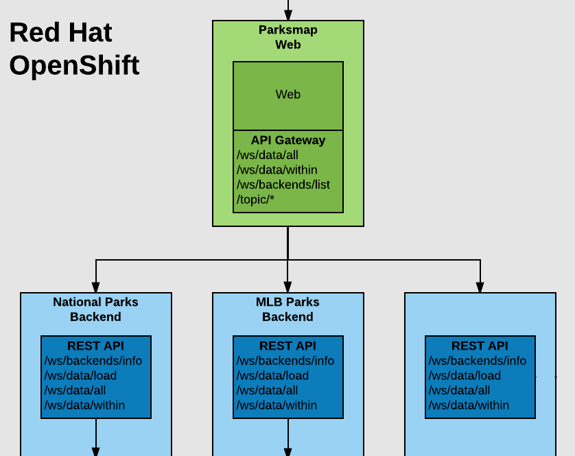
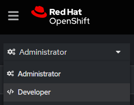
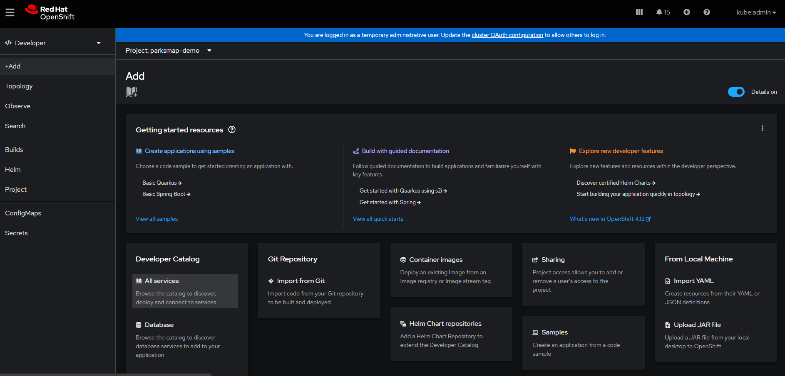
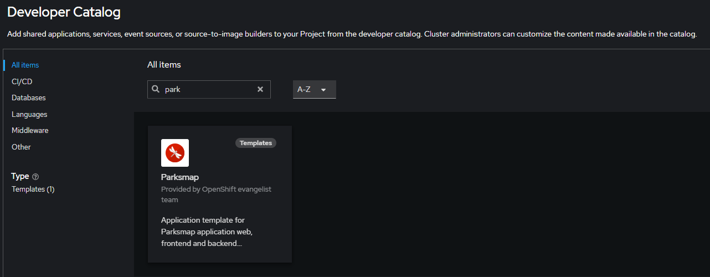
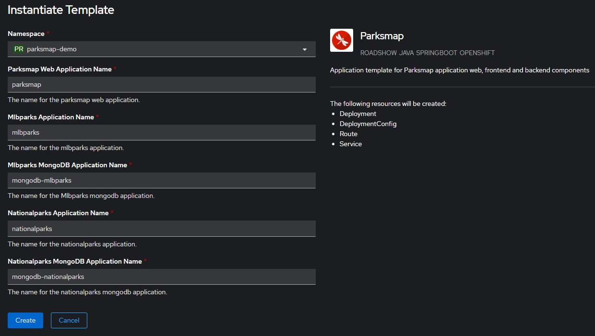
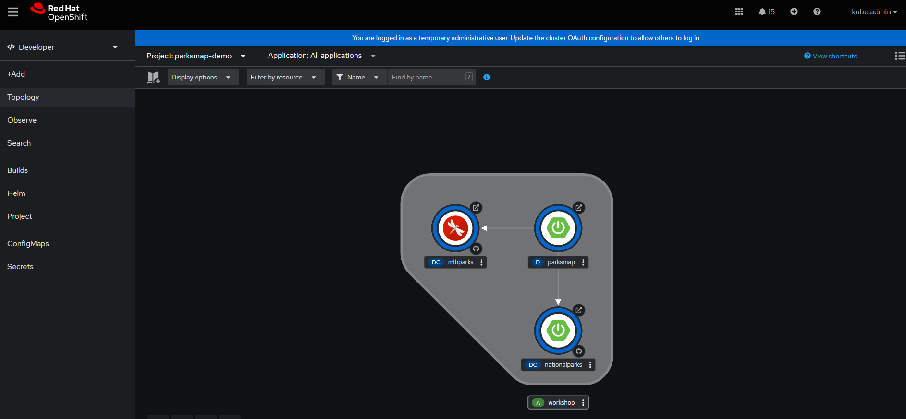
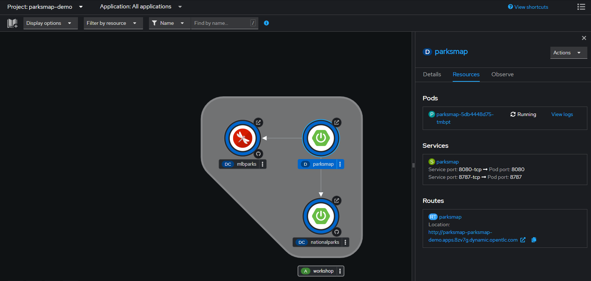
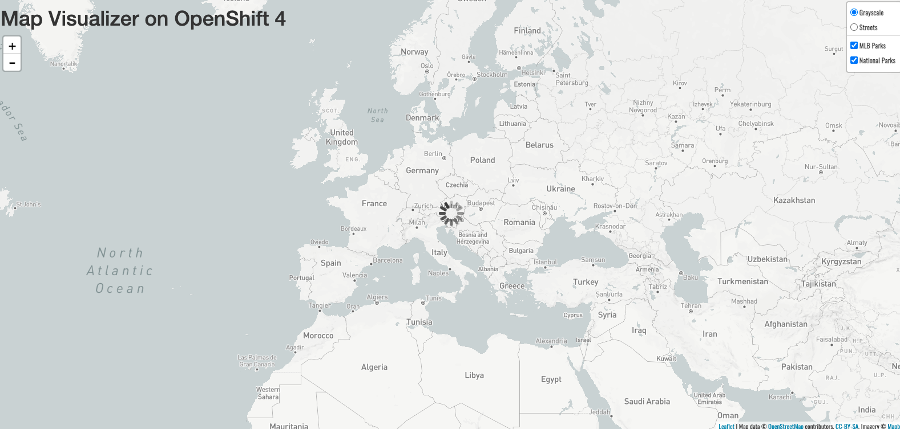

In this lab, we will use the OpenShift Web Console to deploy the frontend and backend components of the ParksMap application, which comprises of one frontend web application, two backend applications and 2 databases:

- ParksMap frontend web application, also called `parksmap`, and uses OpenShift's service discovery mechanism to discover the backend services deployed and shows their data on the map.

- NationalParks backend application queries for national parks information (including their coordinates) that are stored in a MongoDB database. 

- MLBParks backend application queries Major League Baseball stadiums in the US that are stored in an another MongoDB database.

Parksmap frontend and backend components are shown in the diagram below:
 <br/>

  

 <br/>

### 1. Creating the Project

As a first step, we need to create a project where ParksMap application will be deployed. You can create the project with the following command:

```execute
oc new-project %parksmap-project-namespace%
```

### 2.  Grant Service Account View Permissions

The ParksMap frontend application continously monitors the **routes** of the backend applications. This requires granting additional permissions to access OpenShift API to learn about other **Pods**, **Services**, and **Route** within the **Project**. 


```execute
oc policy add-role-to-user view -z default
```

You should see the following output:

~~~bash
clusterrole.rbac.authorization.k8s.io/view added: "default"
~~~

The *oc policy* command above is giving a defined _role_ (*view*) to the default user so that applications in current project can access OpenShift API.

### 3. Navigate to the OpenShift Web Console

Select the **Console** button in the lab environment or go to your **full OpenShift Web Console tab** (%cnvlab-console-url%) to follow the steps below in the OpenShift web console as part of this lab guide.

### 4.  Search for the Application Template

If you are in the Administrator perspective, switch to **Developer** perspective and select **Project: %parksmap-project-namespace%**.



From the menu, select the **+Add** panel. Find the **%parksmap-project-namespace%** project and select it (if you're not asked to choose a project, it's probably because you've already selected one.

You will see a screen where you have multiple options to deploy applications to OpenShift. Click **All Services** as shown below.

 <br/>

  

 <br/>

We will be using `Templates` to deploy the application components. A template describes a set of objects that can be parameterised and processed to produce a list of objects for creation by OpenShift Container Platform. A template can be processed to create anything you have permission to create within a project, for example services, build configurations, and deployment configurations. A template can also define a set of labels to apply to every object defined in the template.

You can create a list of objects from a template using the CLI or, if a template has been uploaded to your project or the global template library, using the web console. In the `Search` text box, enter **parksmap** to find the application template that we've already pre-loaded for you: 

 <br/>

  

 <br/>

### 5. Instantiate the Application Template

Then click on the **Parksmap** template to open the popup menu and then click on the **Instantiate Template** button. This will open a dialog that will *allow* you to configure the following parameters:

- Parksmap Web Application Name
- Mlbparks Application Name
- Mlbparks MongoDB Application Name
- Nationalparks Application Name
- Nationalparks MongoDB Application Name
 <br/>

  

 <br/>

Next click the blue **Create** button **without changing default parameters**. You will be directed to the **Topology** page, where you should see the visualization for the `parksmap` deployment config in the `workshop` application. OpenShift now creates all the Kubernetes resources to deploy the application, including *Deployment*, *Service*, and *Route*.


### 6. Check the Application

These few steps are the only ones you need to run to all 3 application components of `parksmap` on OpenShift. It will take a little while for the the `parksmap` application deployment to complete. Each OpenShift node that is asked to run the images of applications has to pull (download) it, if the node does not already have it cached locally. You can check on the status of the image download and deployment in the *Pod* details page, or from the command line with the `oc get pods` command to check the readiness of pods or you can monitor it from the Developer Console.

Your screen will end up looking something like this:
 <br/> 

   

 <br/>

This is the **Topology** page, where you should see the visualisation for the `parksmap` ,`nationalparks`  and `mlbparks` deployments in the `workshop` application.


### 7. Access the Application

If you click on the `parksmap` entry in the Topology view, you will see some information about that deployment. 

 <br/>



 <br/>

On the "**Resources**" tab, you will see that there is a single *Route* which allows external access to the `parksmap` application. While the *Services* panel provide internal abstraction and load balancing information within the OpenShift environment. The way that external clients are able to access applications running in OpenShift is through the OpenShift routing layer. And the data object behind that is a *Route*. Also note that there is a decorator icon showing `OpenURL` on the `parksmap` visualisation now. If you click that, it will open the URL for your *Route* in a browser:

 <br/>



 <br/>

You can notice that `parksmap` application does not show any parks as we haven't deployed database servers for the backends yet. We'll do that in the next step, select "**Deploy first DB**" below to continue.


