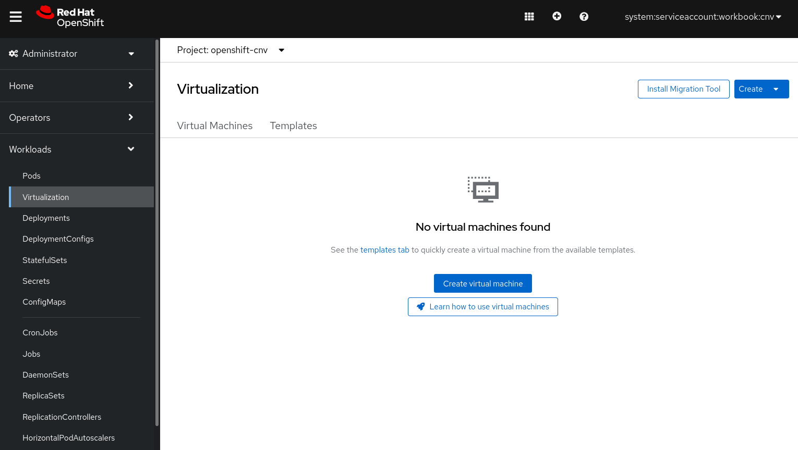

Since OpenShift 4.5, OpenShift Virtualization has been fully supported by Red Hat as a component of OpenShift itself. The mechanism for installation is to utilise the operator model and deploy via the OpenShift Operator Hub in the OpenShift Web Console. It's entirely possible to deploy via the CLI should you wish to do so, but we're not documenting that mechanism here.

Select the "**Console**" button in the top of your lab guide window, or switch over to your dedicated web console page (if you opened one up earlier) and navigate to the top-level '**Operators**' menu entry, and select '**OperatorHub**' (you'll need to make sure that you're in the "Administrator" perspective by using the drop down in the top left hand corner of the web-console). This lists all of the available operators that you can install from the operator catalogue. Start typing '**virtualization**' in the search box and you should see an entry called "**OpenShift Virtualization**". Simply select it and you'll see a window that looks like the following (the version may be slightly different, likely slightly newer):


Next you'll want to select the '**Install**' button, which will take you to a second window where you'll be creating an '*Operator Subscription*'. Leave the defaults here as they'll automatically select the latest version of OpenShift Virtualization, will allow the software to be installed automatically, and will be placed into a new "**openshift-cnv**" project:


Make sure that the namespace it will be installed to is "**openshift-cnv**" - it should be the default entry, but make sure. When you're ready, press the blue **'Install'** button. After a minute or two you'll see that the operator has been configured successfully:


Next we need to deploy the **HyperConverged** resource, which, in addition to the OpenShift Virtualization operator, creates and maintains an OpenShift Virtualization Deployment for the cluster.

> This may raise some questions about a similar term: "hyperconverged infrastructures" and the relationship of workloads and storage associated with that term. For OpenShift Virtualization this relates to the fact that we're converging virtual machines and containers and is how an "instance" of OpenShift Virtualization is instantiated - it does not impact the relation between compute and storage as we will see later in the labs. 

Click on "**Create HyperConverged**", as a required operand, in the same screen to proceed.

This will open a new screen. We can again accept all the defaults for this lab - for real world use, there are many additional flags, parameters, and attributes that can be applied at this stage, such as enabling tech-preview features, specifying host devices, implementing CPU masks, and so on.

Continue the installation by clicking on "**Create**" at the bottom.


Whilst this does its thing, you can move to the '**Workloads**' --> '**Pods**' menu entry and watch it start all of its resources:


You can also briefly return to the '**Terminal**' tab in your hosted lab guide and watch via the CLI:

```execute-1
watch -n2 'oc get pods -n openshift-cnv'
```

> **NOTE**: It may take a few minutes for the pods to start up properly, and you may see a few pods in an "Error/CrashLoopBackOff" state along the way - this is just Kubernetes' reconciliation loop. Press **Ctrl+C** to exit the watch command.

During this process you will see a lot of pods create and terminate. This will continue for some time, depending on your environment. You will know the process is complete when you can return (again, *Ctrl-C* to exit the watch command) to the top terminal and see that the operator installation has been successful by running the following command:

```execute-1
oc get csv -n openshift-cnv
```

You should see the output below; if it still says "**Installing**" in "**PHASE**", then keep waiting and try again:

~~~bash
NAME                                       DISPLAY                    VERSION   REPLACES                                  PHASE
kubevirt-hyperconverged-operator.v4.12.0   OpenShift Virtualization   4.12.0    kubevirt-hyperconverged-operator.v4.11.1  Succeeded
~~~

> **NOTE**: You may have slightly different versions than the ones listed above.

If you do not see `Succeeded` in the `PHASE` column then the deployment may still be progressing, or has failed. You will not be able to proceed until the installation has been successful. Once the `PHASE` changes to `Succeeded` you can validate that the required resources and the additional components have been deployed across the nodes. First let's check the pods deployed in the `openshift-cnv` namespace:


```execute-1
oc get pods -n openshift-cnv
```

This will list the list of pods in *openshift-cnv* project.

~~~bash
NAME                                                   READY   STATUS    RESTARTS   AGE
cdi-operator-6bc7d67d65-ll27w                          1/1     Running   0          35m
cluster-network-addons-operator-5459665bdb-hcrgh       2/2     Running   0          37m
hco-operator-d645ddf55-pl9b6                           1/1     Running   0          37m
hco-webhook-75c6d74599-tcz9v                           1/1     Running   0          37m
hostpath-provisioner-operator-768bfbb69f-87qs6         1/1     Running   0          35m
hyperconverged-cluster-cli-download-5d546f5c7d-wxfjw   1/1     Running   0          37m
ssp-operator-7dc4866b5f-x9l5k                          1/1     Running   0          37m
tekton-tasks-operator-6bd98b49c-6s5dj                  1/1     Running   0          37m
virt-operator-78b66d4c69-fw5kb                         1/1     Running   0          35m
virt-operator-78b66d4c69-rr76r                         1/1     Running   0          35m
~~~

> **NOTE**: All pods shown from this command should be in the `Running` state. You will have many different types, the above snippet is just an example of the output at one point in time, you may have more or less at any one point. Below we discuss some of the pod types and what they do.

You may check by using grep to do inverse-filtering for any 'Running' pods:

```execute-1
oc get pods -n openshift-cnv | grep -v Running
```

This should return an empty result, i.e. ALL pods are running successfully:

~~~bash
NAME                                                  READY   STATUS    RESTARTS   AGE
~~~


Together, all of these pods are responsible for various functions of running a virtual machine on-top of OpenShift/Kubernetes. See the table below that describes some of the various different pod types and their function:

| Pod Name                             | Pod Responsibilities |
| ------------------------------------ | -------------------- |
| *[cdi-operator](https://github.com/kubevirt/containerized-data-importer)*                              | The Containerized Data Importer (CDI) is a Kubernetes extension to populate PVCs with VM disk images or other data. CDI pods allow OpenShift Virtualization to import, upload and clone Virtual Machine images. |
| *[cluster-network-addons-operator](https://github.com/kubevirt/cluster-network-addons-operator)*    | Allows the installation of additional networking plugins. |
| *[hco-operator](https://github.com/kubevirt/hyperconverged-cluster-operator)*                       | Allows users to deploy and configure multiple operators in a single operator and via a single entry point. An "operator of operators." |
| *[hco-webhook](https://github.com/kubevirt/hyperconverged-cluster-operator)*                       | Validates the HyperConverged custom resource contents. |
| *[hostpath-provisioner-operator](https://github.com/kubevirt/hostpath-provisioner-operator)*      |Operator that manages the hostpath-provisioner, which provisions storage on network filesystems mounted on the host.|
| *[hyperconverged-cluster-cli-download](https://github.com/kubevirt/hyperconverged-cluster-operator)*              |Provides the virtctl tool binaries making it possible to download them directly from the cluster.|
| *[ssp-operator](https://github.com/kubevirt/ssp-operator)*              |Scheduling, Scale and Performance operator for OpenShift. The Hyperconverged Cluster Operator automatically installs the SSP operator when deploying.|
| *[tekton-tasks-operator](https://github.com/kubevirt/kubevirt-tekton-tasks)*              |Deploys the pipelines that allow the user to create and manage VMs.|
| *virt-operator*                           |Responsible for deploying, managing and upgrading OpenShift Virtualization without disrupting the current VMs workloads.|


Before continuing with the installation, we will need to install the "**NMState Operator**" which provides a Kubernetes API for performing state-driven network configuration across the OpenShift cluster’s nodes.

If you're not in the Console tab, select "**Console**" in the top of your lab guide window or switch over your dedicated web console tab in case you opened it earlier. Verify you are in the "Administrator" perspective by using the drop down in the left hand corner. Then, navigate to the '**Operators**' menu entry in the left side of the web console and select "**OperatorHub**" to list all the available operators from the catalogue. You will see the search box where you need to type '**nmstate**'. Select the operator called "**Kubernetes NMState Operator**" and you will see a similar window to this one:


The next step will be clicking on "**Install**", which will take you to a second window. Leave the defaults here, as they will automatically select the latest version available, install the software automatically and place it into the "**openshift-nmstate**" namespace (be careful and verify that it will be installed in the 'openshift-nmstate' project). Here you can find all the details: 


Once finished, press the blue "**Install**" button and wait a couple of minutes to ensure that the operator has been configured successfully:


Once the operator is installed, we still need to create an instance of NMState. Click on ""**View Opearator**"" and then select "**Create instance**" as follows:


This will present us with a form, shall we need to add any advanced configuration parameters. Just click "**Create**" and wait a few minutes for NMState to get installed on all of our nodes.


NMState installation provides different resources like the `NodeNetworkState` (`nns`) which extracts the current network configuration of our nodes - this is used to verify whether physical networking configurations have been successfully applied by the `nmstate-handler` pods. This is useful for ensuring that the NetworkManager state on each node is configured as required. We use this for defining interfaces/bridges on each of the machines for both physical machine connectivity and for providing network access for pods (and virtual machines) within OpenShift/Kubernetes. View the NodeNetworkState state with:

```execute-1
oc get nns -A
```

Which shows the list of nodes being managed:

~~~bash
NAME                           AGE
ocp4-master1.aio.example.com   8m37s
ocp4-master2.aio.example.com   8m27s
ocp4-master3.aio.example.com   8m37s
ocp4-worker1.aio.example.com   8m51s
ocp4-worker2.aio.example.com   8m50s
ocp4-worker3.aio.example.com   8m54s
~~~

You can then view the details of each managed node with:

```execute-1
oc get nns/ocp4-worker1.aio.example.com -o yaml
```

This shows the NodeNetworkState definition in *YAML* format:
~~~yaml
apiVersion: nmstate.io/v1beta1
kind: NodeNetworkState
metadata:
  creationTimestamp: "2023-02-16T16:46:29Z"
  generation: 1
  name: ocp4-worker1.aio.example.com
(...)
    interfaces:
    - accept-all-mac-addresses: false
      ethtool:
        feature:
          tx-generic-segmentation: true
          tx-tcp-segmentation: true
          tx-vlan-hw-insert: true
      ipv4:
        address: []
        enabled: false
      ipv6:
        address: []
        enabled: false
      mac-address: 8A:51:4A:1C:9A:49
      mtu: 1450
      name: br0
      state: down
      type: ovs-interface
    - accept-all-mac-addresses: false
      ethernet:
        auto-negotiation: false
      ethtool:
        feature:
          tx-generic-segmentation: true
          tx-tcp-segmentation: true
        ring:
          rx: 256
          tx: 256
      ipv4:
        address:
        - ip: 172.22.0.68
          prefix-length: 24
        auto-dns: true
        auto-gateway: true
        auto-route-table-id: 0
        auto-routes: true
        dhcp: true
        enabled: true
      ipv6:
        addr-gen-mode: eui64
        address:
        - ip: fe80::dcad:beff:feef:4
          prefix-length: 64
        auto-dns: true
        auto-gateway: true
        auto-route-table-id: 0
        auto-routes: true
        autoconf: true
        dhcp: true
        enabled: true
      lldp:
        enabled: false
      mac-address: DE:AD:BE:EF:00:04
      mtu: 1500
      name: enp1s0
      state: up
      type: ethernet
(...)
~~~

Here you can see the current state of the node (some of the output has been cut), the interfaces attached, and their physical/logical addresses. In a later section we're going to be modifying the network node state by applying a new configuration to allow nodes to utilise another interface to provide pod networking via a **bridge**. We will do this via a `NodeNetworkConfigurationEnactment` or `nnce` in short. We do not currently have any *nnce*'s configured:

```execute-1
oc get nnce -n openshift-cnv
```

It should not find any *nnce* definitions yet, as we've not defined any:
~~~bash
No resources found
~~~


### Viewing the OpenShift Virtualization Dashboard

When OpenShift Virtualization is deployed it adds additional components to OpenShift's web console so you can interact with objects and custom resources defined by OpenShift Virtualization, including `VirtualMachine` types. If you select the "**Console**" button at the top of this pane, or return to your dedicated tab (if available), you can now navigate to "**Workloads**" --> "**Virtualization**" on the left-hand side panel, and you should see the new snap-in component for OpenShift Virtualization. Note that you shouldn't have any virtual machines defined:



> **NOTE**: Please don't try and create any virtual machines just yet, we'll get to that shortly!

Before we get started with workload deployment we need to configure some storage. Choose "**Storage Setup**" below to move to the next part of the lab.
