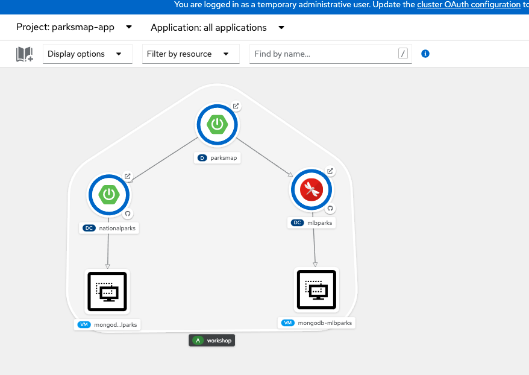
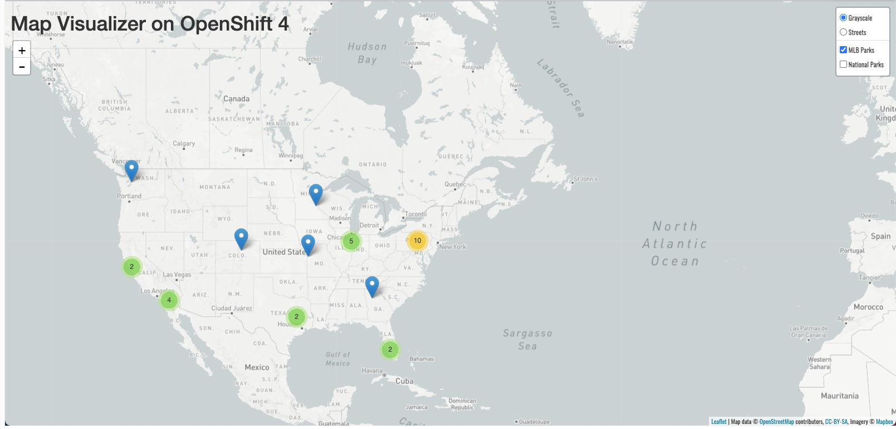

In this section we will deploy an additional MongoDB database in a VM, called `mlbparks`, which will store the location of Major League Baseball stadiums; this will provide a secondary data source for our visualisation application (parksmap). This time we are going to deploy the MongoDB Virtual Machine with using command line.

### 1. Creating MongoDB Virtual Machine

Make sure that you're in the "Terminal" view on the lab guide and switch to *%parksmap-project-namespace%* project by executing following command, ignoring any errors that tell you that you're already in that project:

```execute
oc project %parksmap-project-namespace%
```

And then run the following command to instantiate the template, overriding the MongoDB Application name:

```execute
oc process mongodb-vm-template \
	-p MONGODB_APPLICATION_NAME=mongodb-mlbparks \
	-n openshift | oc create -f -
```

### 2. Verify the Database Service in Virtual Machine  

It will take some time for the MongoDB VM to start and initialise, just like the first time we did it. We can watch for the status by asking OpenShift for a list of VM's:

```execute
oc get vm
```

We should now see two VM's running:

~~~bash
NAME                    AGE   STATUS    READY
mongodb-mlbparks        45s   Running   True
mongodb-nationalparks   22m   Running   True
~~~

Like before, this template is setup to utilise cloud-init to automatically bootstrap the VM with MongoDB and ensure that the service has started, so after a few minutes, the VM should be ready.

### 3. Verify Mlbparks Application

If you go back to the OpenShift web-console by selecting the "**Console**" button at the top of your screen, and switch back to the *Developer* perspective, you should be able to see all `parksmap application` components including the two MongoDB Virtual Machines:

 <br/>

  


Now that we have the database deployed for `mlbparks` , we can again visit the mlbparks web service to query for existing data:


[http://mlbparks-%parksmap-project-namespace%.%cluster_subdomain%/ws/data/all](http://mlbparks-%parksmap-project-namespace%.%cluster_subdomain%/ws/data/all)

And the result is empty as expected, as we've not yet uploaded the data for the MLB Park locations:

~~~bash
[]
~~~

So to load the data, navigate to the following endpoint, which will automatically load in the data for us:

[http://mlbparks-%parksmap-project-namespace%.%cluster_subdomain%/ws/data/load](http://mlbparks-%parksmap-project-namespace%.%cluster_subdomain%/ws/data/load)

Now you should see the following:

~~~bash
Items inserted in database: 30
~~~

If you return to your parksmap visualisation application in your browser you should be able to see the stadium locations in United States as well, and be able to switch between MLB Parks, and National Parks:

[http://parksmap-%parksmap-project-namespace%.%cluster_subdomain%](http://parksmap-%parksmap-project-namespace%.%cluster_subdomain%)

 <br/> 

  

When you're ready to proceed, select "**Backup and Restore**" below to continue with the next lab section.
