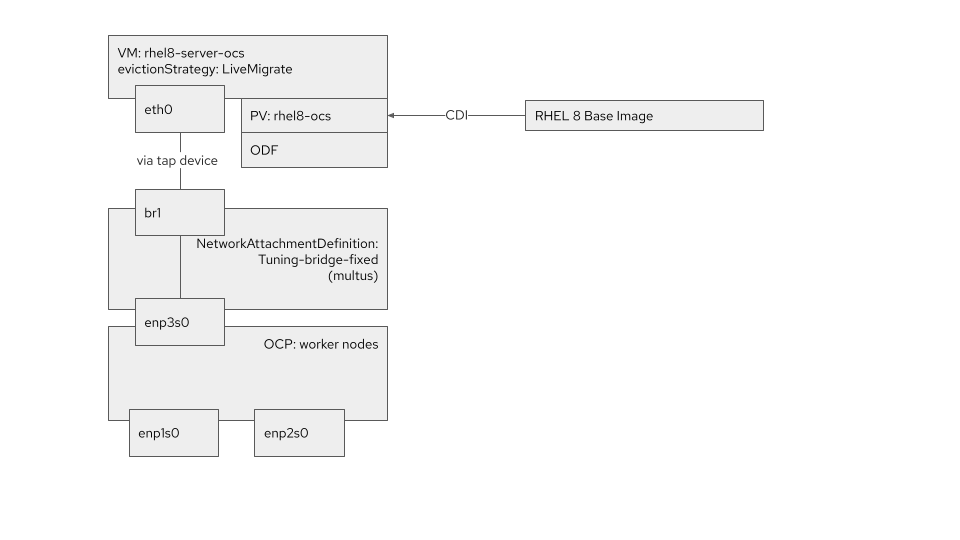
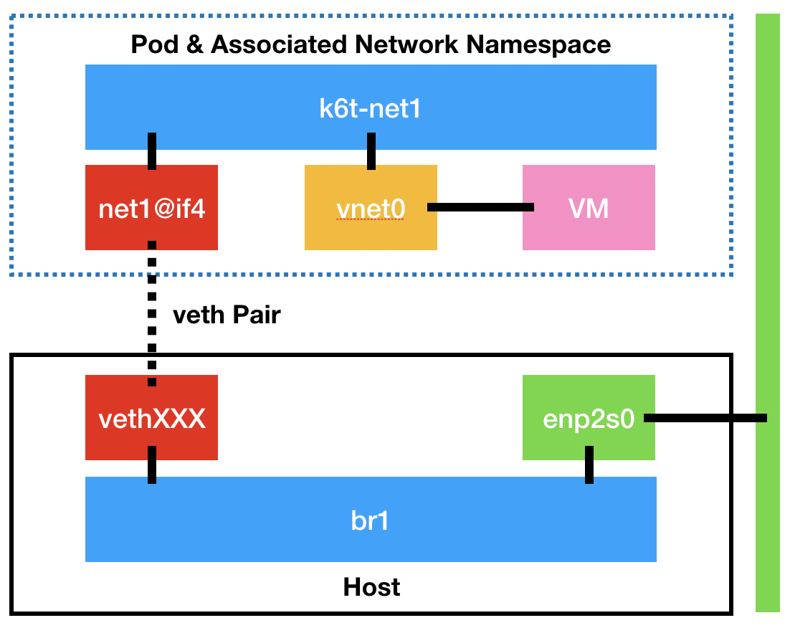

Now let's bring all these configurations together and actually launch some workloads!

> **NOTE**: We're calling most of the resources "RHEL 8" here, regardless of whether you're actually using CentOS 8 as your base image - it won't impact anything for our purposes here.

The virtual machine we're going to create will have the following properties-

* We are going to create a machine called `rhel8-server-ocs`.
* We'll utilise the Persistent Volume Claim (PVC) called `rhel8-ocs` that was created using the CDI utility with a CentOS 8 base image.
* We will utilise the `NetworkAttachmentDefinition` we created for the underlying host's third NIC (`enp3s0` via `br1`). This is the `tuning-bridge-fixed` interface which refers to that bridge created previously.
* As we're using Multus as its default networking CNI we also ensure Multus attaches this `NetworkAttachmentDefinition`.
* Lastly we have set the `evictionStrategy` to `LiveMigrate` so that any request to move the instance will use this method (we will explore this in more depth in a later lab).

A high-level view of these components is as follows:



Let's apply this VM configuration via the CLI first:

```execute-1
cat << EOF | oc apply -f -
apiVersion: kubevirt.io/v1alpha3
kind: VirtualMachine
metadata:
  annotations:
    name.os.template.kubevirt.io/rhel8: Red Hat Enterprise Linux 8.0
  labels:
    app: rhel8-server-ocs
    kubevirt.io/os: rhel8
    os.template.kubevirt.io/rhel8: 'true'
    template.kubevirt.ui: openshift_rhel8-generic-small
    vm.kubevirt.io/template: openshift_rhel8-generic-small
    workload.template.kubevirt.io/generic: 'true'
  name: rhel8-server-ocs
spec:
  running: true
  template:
    metadata:
      labels:
        vm.kubevirt.io/name: rhel8-server-ocs
    spec:
      domain:
        cpu:
          cores: 1
          sockets: 1
          threads: 1
        devices:
          disks:
          - disk:
              bus: sata
            name: rhel8-ocs
          interfaces:
          - bridge: {}
            model: e1000
            name: tuning-bridge-fixed
        firmware:
          uuid: 5d307ca9-b3ef-428c-8861-06e72d69f223
        machine:
          type: q35
        resources:
          requests:
            memory: 1024M
      evictionStrategy: LiveMigrate
      networks:
        - multus:
            networkName: tuning-bridge-fixed
          name: tuning-bridge-fixed
      terminationGracePeriodSeconds: 0
      volumes:
      - name: rhel8-ocs
        persistentVolumeClaim:
          claimName: rhel8-ocs
EOF
```

You should see a `VirtualMachine` object is created:

~~~bash
virtualmachine.kubevirt.io/rhel8-server-ocs created
~~~

This starts to **schedule** the virtual machine across the available hypervisors, which we can see by viewing the VM and VMI objects:


```execute-1
oc get vm
```

This command will list the `VirtualMachine` objects:

~~~bash
NAME               AGE   STATUS     READY
rhel8-server-ocs   4s    Starting   False
~~~

Now execute following command to list the *instance* of that virtual machine object:

```execute-1
oc get vmi
```

This command will list the `VirtualMachineInstance` objects:


~~~bash
NAME               AGE   PHASE     IP    NODENAME                       READY
rhel8-server-ocs   15s   Running         ocp4-worker3.%node-network-domain%   True
~~~

> **NOTE**: A `vm` object is the definition of the virtual machine, whereas a `vmi` is an instance of that virtual machine definition. In addition, you need to have the `qemu-guest-agent` installed in the guest for the IP address to show in this list, and it may take a minute or two to appear.

What you'll find is that OpenShift spawns a pod that manages the provisioning of the virtual machine in our environment, known as the `virt-launcher`:

```execute-1
oc get pods
```

Check whether `virt-launcher` is running:

~~~bash
NAME                                   READY   STATUS    RESTARTS   AGE
virt-launcher-rhel8-server-ocs-z5rmr   1/1     Running   0          3m5s
~~~

Then execute following to describe the details (if you copy from the lab remember to change the pod name to reflect your pod shown in the terminal):

```copy
oc describe pod virt-launcher-rhel8-server-ocs-z5rmr
```

This command will list pod details in yaml format:

~~~yaml
Name:         virt-launcher-rhel8-server-ocs-z5rmr
Namespace:    default
Priority:     0
Node:         ocp4-worker3.%node-network-domain%/192.168.123.106
Start Time:   Mon, 08 Nov 2021 13:47:23 +0000
Labels:       kubevirt.io=virt-launcher
              kubevirt.io/created-by=8d58ce9f-61bd-4c5f-82d1-15dbc9c3897e
              vm.kubevirt.io/name=rhel8-server-ocs
Annotations:  k8s.v1.cni.cncf.io/network-status:
                [{
                    "name": "openshift-sdn",
                    "interface": "eth0",
                    "ips": [
                        "10.129.2.16"
                    ],
                    "default": true,
                    "dns": {}
                },{
                    "name": "default/tuning-bridge-fixed",
                    "interface": "net1",
                    "mac": "02:7c:a4:00:00:00",
                    "dns": {}
                }]
              k8s.v1.cni.cncf.io/networks: [{"interface":"net1","mac":"02:7c:a4:00:00:00","name":"tuning-bridge-fixed","namespace":"default"}]
              k8s.v1.cni.cncf.io/networks-status:
                [{
                    "name": "openshift-sdn",
                    "interface": "eth0",
                    "ips": [
                        "10.129.2.16"
                    ],
                    "default": true,
                    "dns": {}
                },{
                    "name": "default/tuning-bridge-fixed",
                    "interface": "net1",
                    "mac": "02:7c:a4:00:00:00",
                    "dns": {}
                }]
              kubevirt.io/domain: rhel8-server-ocs
Status:       Running
(...)
~~~

When you look into this launcher pod, you'll see that it has the same libvirt functionality we find in existing Red Hat virtualisation products like RHV and OpenStack. First get a shell on the pod that's operating our virtual machine, recalling that each VM has a `virt-launcher` pod associated to it:

```execute-1
oc get pods
```

See the pod is running

~~~bash
NAME                                   READY   STATUS    RESTARTS   AGE
virt-launcher-rhel8-server-ocs-z5rmr   1/1     Running   0          30h
~~~

Execute following to open a bash shell in the pod (if you copy from the lab remember to chnage the pod name to reflect your pod shown in the terminal):

```copy
oc exec -it virt-launcher-rhel8-server-ocs-z5rmr bash
```
And then you can run the usual virsh commands:


```execute-1
virsh list --all
```

Verify the process is running

~~~bash
 Id   Name                       State
------------------------------------------
 1    default_rhel8-server-ocs   running
~~~

We can also verify the storage attachment, which should be an RBD volume as it's come from OCS:

```execute-1
virsh domblklist default_rhel8-server-ocs
```

This command will list the block devices:

~~~bash
 Target   Source
--------------------------
 sda      /dev/rhel8-ocs
~~~

And execute the following to check block device:

```execute-1
lsblk /dev/rhel8-ocs 
```

This command will list information about specified block device:

~~~bash
NAME     MAJ:MIN RM  SIZE RO TYPE MOUNTPOINT
rbd1     251:16   0   40G  0 disk 
└─rbd1p1 251:17   0  7.8G  0 part
~~~

And for networking:

```execute-1
virsh domiflist default_rhel8-server-ocs
```

This command will list information about network interfaces:

~~~bash
 Interface   Type     Source     Model   MAC
------------------------------------------------------------
 tap1        ethernet   -        e1000   02:7c:a4:00:00:00
~~~

But let's go a little deeper with the following command:

```execute-1
ip link | grep -A2 tap1
```

If we look at tap1 we'll see that it's part of a bridge called "*k6t-net1*":

~~~bash
6: tap1: <BROADCAST,MULTICAST,UP,LOWER_UP> mtu 1500 qdisc fq_codel master k6t-net1 state UP mode DEFAULT group default qlen 1000
    link/ether ca:e9:2f:35:2c:a1 brd ff:ff:ff:ff:ff:ff
~~~

Let's look more deeply at that bridge:

```execute-1
ip link | grep -A2 k6t-net1
```

 You should see the details:

~~~bash
4: net1@if29: <BROADCAST,MULTICAST,UP,LOWER_UP> mtu 1500 qdisc noqueue master k6t-net1 state UP mode DEFAULT group default 
    link/ether 02:7c:a4:12:0d:6f brd ff:ff:ff:ff:ff:ff link-netnsid 0
5: k6t-net1: <BROADCAST,MULTICAST,UP,LOWER_UP> mtu 1500 qdisc noqueue state UP mode DEFAULT group default 
    link/ether 02:7c:a4:12:0d:6f brd ff:ff:ff:ff:ff:ff
6: tap1: <BROADCAST,MULTICAST,UP,LOWER_UP> mtu 1500 qdisc fq_codel master k6t-net1 state UP mode DEFAULT group default qlen 1000
    link/ether ca:e9:2f:35:2c:a1 brd ff:ff:ff:ff:ff:ff
~~~

In this example that bridge device has an interface called **"*net1@if29*"** (yours may be slightly different - **note it down now for the next few steps**):

That's showing that there's a bridge inside of the pod called "**k6t-net1**" with both the **"tap1"** (the device attached to the VM), and the **"net1@if29"** device being how the packets get out onto the bridge on the hypervisor (more shortly):

```execute-1
virsh dumpxml default_rhel8-server-ocs | grep -A8 "interface type"
```

This will show interface information in XML format:

~~~xml
    <interface type='ethernet'>
      <mac address='02:7c:a4:00:00:00'/>
      <target dev='tap1' managed='no'/>
      <model type='e1000'/>
      <mtu size='1500'/>
      <alias name='ua-tuning-bridge-fixed'/>
      <rom enabled='no'/>
      <address type='pci' domain='0x0000' bus='0x02' slot='0x01' function='0x0'/>
    </interface>
~~~

Exit the shell before proceeding:

```execute-1
exit
```

Execute `oc whoami` here just makes sure you're in the right place:

```execute-1
oc whoami
```

And see below:

~~~bash
system:serviceaccount:workbook:cnv
~~~

Now, how is this plugged on the underlying host? 

The key to this is the **"net1@if29"** device (it may be slightly different in your environment); this is one half of a **"veth pair"** that allows network traffic to be bridged between network namespaces, which is exactly how containers segregate their network traffic between each other on a container host. In this example the **"cnv-bridge"** is being used to connect the bridge for the virtual machine (**"k6t-net1"**) out to the bridge on the underlying host (**"br1"**), via a veth pair. The other side of the veth pair can be discovered as follows. First find the host of our virtual machine:

```execute-1
oc get vmi
```

Your host is listed under `NODENAME` and may be different than the one below:

~~~bash
NAME               AGE   PHASE     IP               NODENAME                       READY
rhel8-server-ocs   30h   Running   192.168.123.64   ocp4-worker3.%node-network-domain%   True
~~~

Then connect to it and track back the link - here you'll need to adjust the commands below - if your veth pair on the pod side was **"net1@if29"** (yours may be different, if it use the value we asked you to record above) then the **ifindex** in the command below will be **"29"**, if it was **"net1@if5"** then **"ifindex"** will be **"5"** and if it was **net1@if109** it's "**109**", etc.

To do this we need to get to the worker running our virtual machine, and we can use the `oc debug node` function to do this (adjust to suit the host of your virtual machine from the previous command):

```execute-1
oc debug node/ocp4-worker3.%node-network-domain%
```

This will open a debug pod:

~~~bash
Starting pod/ocp4-worker3aioexamplecom-debug ...
To use host binaries, run `chroot /host`
Pod IP: 192.168.123.106
If you don't see a command prompt, try pressing enter.
~~~

Switch into the hosts namespace:

```execute-1
chroot /host
```

Then execute the following, **but remember to replace the ifindex with the number you recorded above**:

```
export ifindex=29
```

After that check netns and find the veth name:


```execute-1
ip -o link | grep ^$ifindex: | sed -n -e 's/.*\(veth[[:alnum:]]*@if[[:digit:]]*\).*/\1/p'
```

Which returns something like:

~~~bash
veth9d567769@if4
~~~

Therefore, the other side of the link, in the example above, is **"veth9d567769@if4"**. Run the following command replacing it with the veth value you found:

```copy
ip link show veth9d567769  
```

You should see that it is attached to **"br1"** as in this example:

~~~bash
29: veth9d567769@if4: <BROADCAST,MULTICAST,UP,LOWER_UP> mtu 1500 qdisc noqueue master br1 state UP mode DEFAULT group default 
Error: Peer netns reference is invalid.
    link/ether 16:6b:ba:90:da:87 brd ff:ff:ff:ff:ff:ff link-netns c3dde5db-32f3-47a7-b7a8-3705dd17f8e1
~~~

Note the "**master br1**" in the above output.

Or visually represented:



Exit the debug shell(s) before proceeding, remembering to do this **twice** as the first exits from the chroot, the second from the debug pod:

```execute-1
exit
```

Remember, it should notify you with "Removing debug pod ..." to demonstrate that you're leaving debug mode. When you're ready, execute `oc whoami` here just to make sure you're in the right place:

```execute-1
oc whoami
```

You should see:

~~~bash
system:serviceaccount:workbook:cnv
~~~

Then ensure you are in the default project:

```execute-1
oc project default
```

That's it for deploying basic workloads as we've successfully deployed a VM on-top of OCS!  Let's trying doing more with those workloads. Select "**Live Migration**" below for the next lab.
