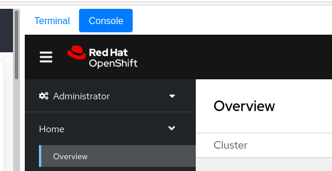
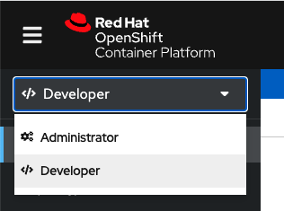

#### Command Line Interface (CLI)

OpenShift includes a feature-rich web console with both an *Administrator* and a *Developer* perspective. In addition to the web console, OpenShift includes command line tools to provide users with a comprehensive interface to work with applications deployed on the platform.  The `oc` command line tool is an executable built on-top of `kubectl` and is written in the Go programming language. It is available for Windows, MacOS, and Linux

This lab environment has the `oc` command line tool installed, and your lab user is already logged in to the OpenShift cluster with administrative access - you're not sharing this cluster with anyone else. As an example, issue the following command to see help information for the CLI:

```execute-1
oc help
```

#### Using a Project

Projects are a top level concept to help you organise your resources. An OpenShift project allows a community of users (or a single user) to organise and manage their content/resources in isolation from other communities. Each project has its own resources, policies (who can/cannot perform actions), and constraints (quotas and limits on resources, etc). Projects act as a "wrapper" around all the application services and endpoints you, or your teams, are using for your work.

#### Web Console

OpenShift ships with a web-based console that will allow users to perform various tasks via a web browser. From within the lab guide window you'll see two buttons at the top of the screen, with the currently active tab in blue, one for the "**Terminal**", the default, and one for the "**Console**"; you can switch between these two options at will. Select the console and you should see the OpenShift web console, in which you'll already be logged in:



**Entirely Optional**: However, if you want to open up an additional **dedicated** tab/window for the Web Console you can do so, simply click on [this link](http://console-openshift-console.%cluster_subdomain%/dashboards), although you will have to return to the instructions to get the "kubeadmin" (the OpenShift administrator user) password. To get the *kubeadmin-password* we'll need to grab it from the OpenShift installation directory on the server in which the cluster was installed from, or in our case the "bastion" node. Let's jump over to that machine to get it.

From within this lab guide, SSH to the bastion node:

```execute-1
ssh %bastion-username%@%bastion-host%
```

When you see the prompt, if required, agree to the SSH certificates by typing "yes", and then enter **%bastion-password%** as the password. Then you can execute following command to get the kubeadmin password:

```execute-1
echo $(cat %kubeadmin-password-file%)
```

Note the password (or copy it) and exit the ssh session:

```execute-1
exit
```

> **NOTE**: Make sure that you exit from this session before proceeding!

```execute-1
oc whoami
```
The above output should show "**system:serviceaccount:workbook:cnv**", if it doesn't or it shows "**system:admin**" you've not yet disconnected from the session.

In the new tab that you've opened up you should be presented with the OpenShift login screen, enter the following credentials:

- Username: *kubeadmin*
- Password: (the password you previously copied)

The first time you access the web console, you will most likely be in the *Administrator* perspective. At the top of the left navigation menu, you can toggle between the Administrator perspective and the Developer perspective.



Select **Developer** to switch to the Developer perspective. Once the Developer perspective loads, you should select the **Topology** view from the menu on the left-hand side. Right now, there are no applications or components to view, but once you begin working on the lab, you'll be able to visualise and interact with the components in your application here.

We will be using a mix of command line tooling and the web console for the labs. Select "**Validate**" below to continue with the validation of the environment and to become more familiar with OpenShift and its core functionality.