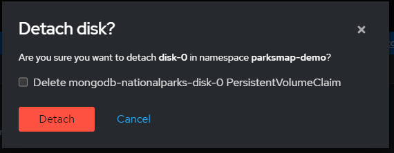

### Background: Hot-plugging virtual disks
It is expected to have **dynamic reconfiguration** capabilities for VMs today, such as CPU/Memory/Storage/Network hot-plug/hot-unplug. Although these capabilities have been around for the traditional virtualisation platforms, it is a particularly challenging feature to implement in a **Kubernetes** platform because of the Kubernetes principle of **immutable pods**, where once deployed they are never modified. If something needs to be changed, you never do so directly on the Pod. Instead, you’ll build and deploy a new one that has all your needed changes baked in. OpenShift Virtualization strives to have these dynamic reconfiguration capabilities for VMs although it's a Kubernetes-based platform.

### Exercise: Hot-plugging a virtual disk using the web console
In OpenShift Virtualization it's possible to hot-plug and hot-unplug virtual disks without stopping your virtual machine. This capability is helpful when you need to add storage to a running virtual machine without incurring down-time. When you hot-plug a virtual disk, you attach a virtual disk to a virtual machine instance while the virtual machine is running. When you hot-unplug a virtual disk, you detach a virtual disk from a virtual machine instance while the virtual machine is running. Only data volumes and persistent volume claims (PVCs) can be hot-plugged and hot-unplugged. You cannot hot-plug or hot-unplug *container* disks.

In this exercise, let's attach a new 5GB disk to one of our MongoDB database VM's by using the **real OpenShift Web Console** (%cnvlab-console-url%):
<table>
  <tr>
    <td>

1. Click **Virtualization** from the side menu.
   
2. Click the **Virtual Machines** tab.
   
3. Select **mongodb-nationalparks** virtual machine to open its **Overview** screen.

4. On the **Disks** tab, click **Add Disk**.

5. In the **Add Disk** window, fill in the information for the virtual disk that you want to hot-plug. Type the **name** for your disk, keep **Blank (creates PVC)** as **Source** and change the **Persistent Volume Claim Size** to **5 GiB**, as shown in the image.

6. Click **Add**.
   </td>
   <td></td>
    </tr>
    </table>

Once you click **Save**, a new vm disk is automatically provisioned using the selected storage class, which is ceph-rbd in this exercise, and attached to the running virtual machine. You can see the new disk in the Disks tab of the virtual machine.

</td>

To verify if the new 5GB disk is recognised and ready to use by the guest operating system, let's connect the console of our virtual machine and list block devices:

1. Click **Virtualization** from the side menu.
   
2. Click the **Virtual Machines** tab.
   
3. Select **mongodb-nationalparks** virtual machine to open its **Overview** screen.

4. Navigate to the "**Console**" tab. You'll be able to login with "**redhat/openshift**", noting that you may have to click on the console window for it to capture your input.

5. Once you're in the virtual machine, run the *lsblk* command to list block devices recognised by the operating system.
```copy
sudo lsblk
```
</td>

> **NOTE**: This showed up as "**sda**", as the default interface is "**scsi**" - if we'd have chosen "virtio" this would have been a "**vd***" device.

### Exercise: Expand the VM's disk

OpenShift allows users to easily resize an existing PersistentVolumeClaim (PVC) objects. You no longer have to manually interact with the storage backend or delete and recreate PV and PVC objects to increase the size of a volume. Shrinking persistent volumes is not supported. In this exercise, let's resize our hot-plugged 5GB disk to 7GB by using the web console.

<table>
  <tr>
    <td>

1. Click **Virtualization** from the side menu.
   
2. Click the **Virtual Machines** tab.
   
3. Select **mongodb-nationalparks** virtual machine to open its **Overview** screen.

4. On the **Disks** tab, click the **PVC name** of the `PersistingHotplug` disk. In my case, for the *disk-0* will be *mongodb-nationalparks-disk-0*.

5. In the **PersistentVolumeClaims** window, click **Actions** → **Expand PVC**.

6. In the **Expand PersistentVolumeClaim** pop-up window, set the **Total Size** as **7 GiB**

7. Click **Expand**.
   
   </td>
   <td></td>
    </tr>
    </table>

Now, navigate to **Virtualization** → **Virtual Machines** → **mongodb-nationalparks** → **Console**. You'll be able to login with "**redhat/openshift**" (if you're not already logged in), noting that you may have to click on the console window for it to capture your input. Once you're in the virtual machine, run the lsblk command to list block devices recognized by the operating system.

```execute
sudo lsblk
```
</td>

As you'll recall OpenShift Virtualization creates one pod for each running virtual machine. This pod's primary container runs the virt-launcher. The main purpose of the virt-launcher Pod is to provide the cgroups and namespaces which will be used to host the VM process.
An instance of `libvirtd` is present in every VM pod. virt-launcher uses libvirtd to manage the life-cycle of the VM process.
Libvirt is an open-source API, daemon and management tool for managing platform virtualization including KVM, `virsh` is the most popular command line interface to interact with libvirt daemon `libvirtd`. 

### Exercise: Hot-unplugging a virtual disk using the web console
It's possible to hot-**un**plug virtual disks when you want to remove them without stopping your virtual machine or virtual machine instance. This capability is helpful when you need to remove storage from a running virtual machine without incurring down-time. When you hot-unplug a virtual disk, you detach a virtual disk from a virtual machine instance while the virtual machine is running. Only data volumes and persistent volume claims (PVCs) can be hot-unplugged. In this exercise, let's detach the disk that we have hot-plugged in the previous exercise from our MongoDB database VM by using the web console:

<table>
  <tr>
    <td>

1. Click **Virtualization** from the side menu.
   
2. Click the **Virtual Machines** tab.
   
3. Select **mongodb-nationalparks** virtual machine to open its **Overview** screen.

4. Click the **Disks** tab. The page displays a list of disks attached to the virtual machine.

5. Click the Options menu  of the **disk** named `disk-0` which is marked as `PersistingHotplug`

6. Click **Detach**.
   
7. In the confirmation pop-up window, click **Detach** to hot-unplug the disk.
   </td>
   <td></td>
    </tr>
    </table>

Once you click **Detach** to hot-unplug the disk, it's detached from the running virtual machine and guest operating system automatically recognises the event. To verify if the 7G disk removal is recognised by the guest operating system, let's connect the console of our virtual machine and list block devices once again. The disk should no longer be listed by the guest operating system.

1. Click **Virtualization** from the side menu.
   
2. Click the **Virtual Machines** tab.
   
3. Select **mongodb-nationalparks** virtual machine to open its **Overview** screen.

4. Navigate to the "**Console**" tab. You'll be able to login with "**redhat/openshift**", noting that you may have to click on the console window for it to capture your input.

5. Once you're in the virtual machine, run the lsblk command to list block devices recognised by the operating system.
```execute
sudo lsblk
```
</td>

That's it for hot-plugging and expanding virtual disks - we've hot-plugged a new 5GB disk to our MongoDB database virtual machine using OpenShift web console, expanded its size to 7GB and finally hot-unplugged it from our virtual machine. To move onto the next section of the lab, click "**Network Isolation**" below.
