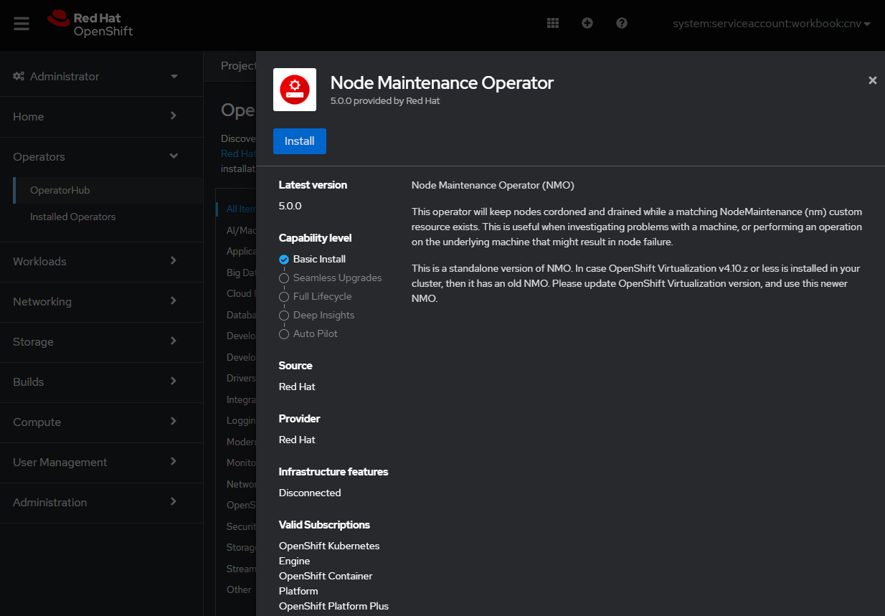
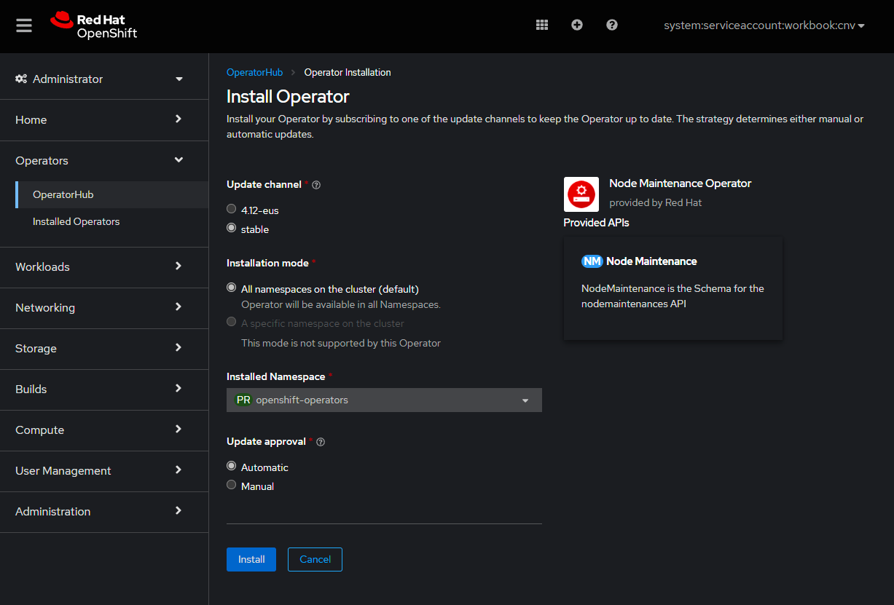
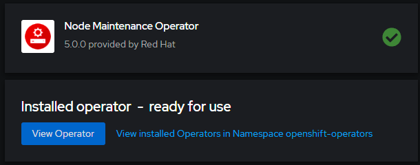
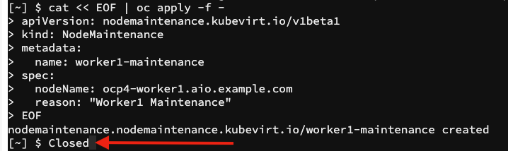

Live Migration is the process of moving an instance from one node in a cluster to another without interruption. This process can be manual or automatic. In OpenShift this is controlled by an `evictionStrategy` strategy. If this is set to `LiveMigrate` and the underlying node are placed into maintenance mode, VMs can be automatically moved between nodes with minimal interruption. 

Live migration is an administrative function in OpenShift Virtualization. While the action is visible to all users, only admins can initiate a migration. Migration limits and timeouts are managed via the `kubevirt-config` `configmap`. For more details about limits see the [documentation](https://docs.openshift.com/container-platform/4.9/virt/live_migration/virt-live-migration-limits.html).

In our lab we currently only have one VM running, use the `vmi` utility to view it:

```execute-1
oc get vmi
```

You should see something similar to the output below, although you may have a different IP address, and on a different node:

~~~bash
NAME               AGE   PHASE     IP               NODENAME                       READY
rhel8-server-ocs   45h   Running   192.168.123.64   ocp4-worker3.aio.example.com   True
~~~

> **NOTE**: In OpenShift Virtualization, the "Virtual Machine" object can be thought of as the virtual machine "source" that virtual machine instances are created from. A "Virtual Machine Instance" is the actual running instance of the virtual machine. The instance is the object you work with that contains IP, networking, and workloads, etc. That's why we delete a VM, and list VMI's.

In this example we can see the `rhel8-server-ocs` instance is on `ocp4-worker3.aio.example.com`. As you may recall we deployed this instance with the `LiveMigrate` `evictionStrategy` strategy but you can also review an instance with `oc describe` to ensure it is enabled.


```execute-1
oc describe vmi rhel8-server-ocs | egrep '(Eviction|Migration)'
```

This command should have a similar output as below, although trimmed:

~~~yaml
  Eviction Strategy:  LiveMigrate
  Migration Method:  LiveMigration
~~~

The easiest way to initiate a migration is to create an `VirtualMachineInstanceMigration` object in the cluster directly against the `vmi` we want to migrate (this can also be conducted via the OpenShift console if we like, and we'll take a look at it in a later lab section). But wait! Once we create this object it will immediatly trigger the migration, so first, let's see what the code looks like:

~~~yaml
apiVersion: kubevirt.io/v1alpha3
kind: VirtualMachineInstanceMigration
metadata:
  name: migration-job
spec:
  vmiName: rhel8-server-ocs
~~~

It's really quite simple, we create a `VirtualMachineInstanceMigration` object and reference the `LiveMigratable ` instance we want to migrate: `rhel8-server-ocs`.  Let's apply this configuration:

```execute-1
cat << EOF | oc apply -f -
apiVersion: kubevirt.io/v1alpha3
kind: VirtualMachineInstanceMigration
metadata:
  name: migration-job
spec:
  vmiName: rhel8-server-ocs
EOF
```

Check that the `VirtualMachineInstanceMigration` object is created:

~~~bash
virtualmachineinstancemigration.kubevirt.io/migration-job created
~~~

Now let's watch the migration job in action. First it will show `phase: Scheduling` :

```execute-1
watch -n1 oc get virtualmachineinstancemigration/migration-job -o yaml
```

With the output:

~~~bash
Every 1.0s: oc get virtualmachineinstancemigration/migration-job -o yaml                 Fri Mar 20 00:33:35 2020

apiVersion: kubevirt.io/v1alpha3
kind: VirtualMachineInstanceMigration
(...)
spec:
  vmiName: rhel8-server-ocs
status:
  phase: Scheduling    <----------- Here you can see it's scheduling
~~~

And then move to `phase: TargetReady` and onto `phase: Succeeded`:

~~~bash
Every 1.0s: oc get virtualmachineinstancemigration/migration-job -o yaml                 Fri Mar 20 00:33:43 2020

apiVersion: kubevirt.io/v1alpha3
kind: VirtualMachineInstanceMigration
(...)
spec:
  vmiName: rhel8-server-ocs
status:
  phase: Succeeded    <----------- Now it has finished the migration
~~~

Finally view the `vmi` object and you can see the new underlying host (was *ocp4-worker3*, now it's *ocp4-worker1*); your environment may have different source and destination hosts, depending on where `rhel8-server-ocs` was initially scheduled. Don't forget to `ctrl-c` out of the running watch command:

```execute-1
oc get vmi
```

Now check the output:

~~~bash
NAME               AGE   PHASE     IP               NODENAME                       READY
rhel8-server-ocs   45h   Running   192.168.123.64   ocp4-worker1.aio.example.com   True 
~~~

As you can see Live Migration in OpenShift Virtualization is quite easy. If you have time, try some other examples. Perhaps start a ping and migrate the machine back. Do you see anything in the ping to indicate the process?

> **NOTE**: If you try and run the same migration job it will report `unchanged`. To run a new job, run the same example as above, but change the job name in the metadata section to something like `name: migration-job2`

Also, rerun the `oc describe vmi rhel8-server-ocs` after running a few migrations. You'll see the object is updated with details of the migrations, including source and target:

```execute-1
oc describe vmi rhel8-server-ocs
```

This will show VMI object in yaml format:
~~~yaml
(...)
  Migration Method:                  LiveMigration
  Migration State:
    Completed:        true
    End Timestamp:    2021-11-10T11:39:20Z
    Migration UID:    2ebfb4e1-0025-4b8b-8c59-9bd986c05505
    Mode:             PreCopy
    Source Node:      ocp4-worker3.aio.example.com
    Start Timestamp:  2021-11-10T11:39:11Z
    Target Direct Migration Node Ports:
      32903:                      49152
      34993:                      0
    Target Node:                  ocp4-worker1.aio.example.com
    Target Node Address:          10.131.0.43
    Target Node Domain Detected:  true
    Target Pod:                   virt-launcher-rhel8-server-ocs-fxz74
  Node Name:                      ocp4-worker1.aio.example.com
  Phase:                          Running
(...)

Events:
  Type    Reason            Age                    From                         Message
  ----    ------            ----                   ----                         -------
  Normal  SuccessfulUpdate  18m                    virtualmachine-controller    Expanded PodDisruptionBudget kubevirt-disruption-budget-8fr8b
  Normal  PreparingTarget   2m53s (x2 over 2m53s)  virt-handler                 VirtualMachineInstance Migration Target Prepared.
  Normal  PreparingTarget   2m53s                  virt-handler                 Migration Target is listening at 10.131.0.43, on ports: 34993,32903
  Normal  Migrating         2m45s (x5 over 2m53s)  virt-handler                 VirtualMachineInstance is migrating.
  Normal  Migrated          2m44s                  virt-handler                 The VirtualMachineInstance migrated to node ocp4-worker1.aio.example.com.
  Normal  Deleted           2m44s                  virt-handler                 Signaled Deletion
  Normal  SuccessfulUpdate  2m41s                  disruptionbudget-controller  shrank PodDisruptionBudget%!(EXTRA string=kubevirt-disruption-budget-8fr8b)
~~~

## Node Maintenance

Building on-top of live migration, many organisations will need to perform node-maintenance, e.g. for software/hardware updates, or for decommissioning. During the lifecycle of a **pod**, it's almost a given that this will happen without compromising the workloads, but virtual machines can be somewhat more challenging given their nature. To address this OpenShift Virtualization works with the (optional) Node Maintenance Operator which manages the process safely by marking nodes unschedulable and migrating workloads (both containers and VMs) automatically. 

Select the "**Console**" button in the top of your lab guide window, or switch over to your dedicated web console page (if you opened one up earlier) and navigate to the top-level '**Operators**' menu entry, and select '**OperatorHub**' (you'll need to make sure that you're in the "Administrator" perspective by using the drop down in the top left hand corner of the web-console). This lists all of the available operators that you can install from the operator catalogue. Start typing '**maintenance**' in the search box and you should see an entry called "**Node Maintenance Operator**". Simply select it and you'll see a window that looks like the following (the version may be slightly different, likely slightly newer):




Next you'll want to select the '**Install**' button, which will take you to a second window where you'll be creating an '*Operator Subscription*'. Leave the defaults here as they'll automatically select the latest version of the Node Maintenance Operator, will allow the software to be installed automatically, and will be placed into a new "**openshift-operators**" project:




Make sure that the namespace it will be installed to is "**openshift-operators**" - it should be the default entry, but make sure. When you're ready, press the blue **'Install'** button. After a minute or two you'll see that the operator has been configured successfully:



Let's now take a look at the current running virtual machines and the nodes we have available:

```execute-1
oc get nodes
```

This lists the OpenShift nodes:

~~~bash
NAME                           STATUS   ROLES    AGE   VERSION
ocp4-master1.aio.example.com   Ready    master   2d    v1.25.4+77bec7a
ocp4-master2.aio.example.com   Ready    master   2d    v1.25.4+77bec7a
ocp4-master3.aio.example.com   Ready    master   2d    v1.25.4+77bec7a
ocp4-worker1.aio.example.com   Ready    worker   2d    v1.25.4+77bec7a
ocp4-worker2.aio.example.com   Ready    worker   2d    v1.25.4+77bec7a
ocp4-worker3.aio.example.com   Ready    worker   2d    v1.25.4+77bec7a
~~~

Now check the VMIs:

```execute-1
oc get vmi
```

You should see the one VM running:

~~~bash
NAME               AGE   PHASE     IP               NODENAME                       READY
rhel8-server-ocs   45h   Running   192.168.123.64   ocp4-worker1.aio.example.com   True
~~~

In this environment, we have one virtual machine running on *ocp4-worker1* (yours may vary). Let's take down the node for maintenance and ensure that our workload (VM) stays up and running. First generate a CRD for the node maintenance:

```execute-1
cat << EOF > nodemaintenance.yaml
apiVersion: nodemaintenance.medik8s.io/v1beta1

kind: NodeMaintenance
metadata:
  name: worker-maintenance
spec:
  nodeName: CHANGE_ME
  reason: "Worker Maintenance"
EOF
```
Make sure that you change the node name in the file (`CHANGE_ME`) to the one that the Virtual Machine is *actually* scheduled on:

```execute-1
vim nodemaintenance.yaml 
```

Apply the configuation within the file in order to create the `NodeMaintenance` custom resource: 

```execute-1
oc apply -f nodemaintenance.yaml 
```

See that the `NodeMaintenance` object is created:

~~~bash
nodemaintenance.nodemaintenance.medik8s.io/worker1-maintenance
~~~

> **NOTE**: You **may** lose your browser based web terminal like this:
>
> 
>
> If this happens you'll need to wait a few seconds for it to become accessible again. Try reloading the terminal from the drop down menu in the upper right of the browser. This is because the OpenShift router and/or workbook pods may be running on the worker you put into maintenance.

Assuming you're connected back in, let's check the status of our environment:

```execute-1
oc project default
```

Ensure you are in the default project:

~~~bash
Now using project "default" on server "https://172.30.0.1:443".
~~~

And check the nodes:

```execute-1
oc get nodes
```

Notice that scheduling is disabled for `worker1` (or the worker that you specified maintenance for): 

~~~bash
NAME                           STATUS                     ROLES    AGE   VERSION
ocp4-master1.aio.example.com   Ready                      master   2d    v1.25.4+77bec7a
ocp4-master2.aio.example.com   Ready                      master   2d    v1.25.4+77bec7a
ocp4-master3.aio.example.com   Ready                      master   2d    v1.25.4+77bec7a
ocp4-worker1.aio.example.com   Ready,SchedulingDisabled   worker   2d    v1.25.4+77bec7a
ocp4-worker2.aio.example.com   Ready                      worker   2d    v1.25.4+77bec7a
ocp4-worker3.aio.example.com   Ready                      worker   2d    v1.25.4+77bec7a
~~~


Now check the VMI:

```execute-1
oc get vmi
```

Note that the VM has been **automatically** live migrated back to an available worker and is not on the `SchedulingDisabled` worker, as per the `EvictionStrategy`, in this case `ocp4-worker3.aio.example.com`. 

~~~bash
NAME               AGE   PHASE     IP               NODENAME                       READY
rhel8-server-ocs   46h   Running   192.168.123.64   ocp4-worker3.aio.example.com   True
~~~


We can remove the maintenance flag by simply deleting the `NodeMaintenance` object - update this to reflect the nodes in your environment:


```execute-1
oc get nodemaintenance
```
It should just show the one:

~~~bash
NAME                  AGE
worker1-maintenance   5m16s
~~~

Now delete it:

> **NOTE**: You may need to modify the below command to specify your `nodemaintenance` object is the same as in the output from above.

```copy
oc delete nodemaintenance/worker1-maintenance
```

It should return the following output:

~~~bash
nodemaintenance.nodemaintenance.medik8s.io "worker1-maintenance" deleted
~~~

Then check the same node again:

```copy
oc get node/ocp4-worker1.aio.example.com
```

Note the removal of the `SchedulingDisabled` annotation on the '**STATUS**' column. Also important is that just because this node has become active again doesn't mean the virtual machine returns to it automatically, i.e. it won't "fail back", it will reside on the new host: 

~~~bash
NAME                           STATUS   ROLES    AGE   VERSION
ocp4-worker1.aio.example.com   Ready    worker   2d    v1.25.4+77bec7a
~~~

Before proceeding let's remove the `rhel8-server-ocs` virtual machine as well as any lingering PVC's we don't need any longer:

```execute-1
oc delete vm/rhel8-server-ocs
```

This should be confirmed with:

~~~bash
virtualmachine.kubevirt.io "rhel8-server-ocs" deleted
~~~

Now delete the PVCs:

```execute-1
oc delete pvc rhel8-ocs
```

It should show the removal:

~~~bash
persistentvolumeclaim "rhel8-ocs" deleted
~~~

Choose "**Clone a Virtual Machine**" to continue with the lab.
