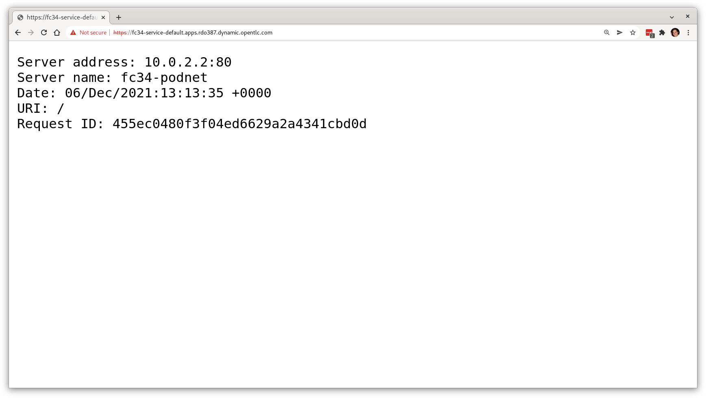

Up to this point we've provisioned our virtual machines on a single bridged network using the more traditional networking models that you may typically encounter in traditional virtualisation environments. OpenShift 4.x utilises Multus as the default CNI, which permits the user to attach multiple network interfaces from different "delegate CNI's" simultaneously. 

Therefore, one of the models available for OpenShift Virtualization is to provide networking with a combination of attachments, including "pod networking". This mean we can have virtual machines attached to the same networks that the container pods are attached to. This has the added benefit of allowing virtual machines to leverage all of the Kubernetes models for services, load balancers, ingress, network policies, node ports, and a wide variety of other functions.

Pod networking is also referred to as "**masquerade** mode" when it's related to OpenShift Virtualization, and it can be used to hide a virtual machine’s outgoing traffic behind the pod IP address. Masquerade mode uses Network Address Translation (NAT) to connect virtual machines to the Pod network backend through a Linux bridge. Masquerade mode is the recommended binding method for VM's that need to use (or have access to) the default pod network.

Utilising pod networking requires the interface to connect using the `masquerade: {}` method and for IPv4 addresses to be allocated via DHCP. We are going to test this with one of the same Fedora images (or PVC's) we used in the previous lab section. In our virtual machine configuration file we need to instruct the machine to use masquerade mode for the interface (there's no command to execute here, just for your information):

~~~
interfaces:
  - name: nic0				      	            
    model: virtio					              
    masquerade: {}
~~~

And connect the interface to the pod network:

~~~bash
networks:
  - name: nic0
    pod: {}
~~~

So let's go ahead and create a `VirtualMachine` using our **existing** Fedora 34 image via a PVC we created previously. *Look closely, we are using our cloned PVC so we get the benefits of the installed **NGINX** server, qemu-guest-agent and ssh configuration!*

```execute-1
cat << EOF | oc apply -f -
apiVersion: kubevirt.io/v1alpha3
kind: VirtualMachine
metadata:
  name: fc34-podnet
  labels:
    app: fc34-podnet
    os.template.kubevirt.io/fedora34: 'true'
    vm.kubevirt.io/template-namespace: openshift
    workload.template.kubevirt.io/server: 'true'
spec:
  running: true
  template:
    metadata:
      labels:
        vm.kubevirt.io/name: fc34-podnet
        flavor.template.kubevirt.io/small: 'true'
        kubevirt.io/size: small
    spec:
      domain:
        cpu:
          cores: 1
          sockets: 1
          threads: 1
        devices:
          disks:
            - bootOrder: 1
              disk:
                bus: virtio
              name: disk0
          interfaces:
            - name: nic0
              model: virtio
              masquerade: {}
          networkInterfaceMultiqueue: true
          rng: {}
        machine:
          type: pc-q35-rhel8.1.0
        resources:
          requests:
            memory: 2Gi
      evictionStrategy: LiveMigrate
      hostname: fc34-podnet
      networks:
        - name: nic0
          pod: {}
      terminationGracePeriodSeconds: 0
      volumes:
        - name: disk0
          persistentVolumeClaim:
            claimName: fc34-original
EOF
```

This should start a new VM:

~~~bash
virtualmachine.kubevirt.io/fc34-podnet created
~~~

After a few minutes, this VM should be started, and we can check with this command:

```execute-1
oc get vmi
```

We should then see our VM running:

~~~bash
NAME          AGE   PHASE     IP             NODENAME                       READY
fc34-podnet   68s   Running   10.129.2.210   ocp4-worker2.aio.example.com   True
~~~

We can see the Virtual Machine Instance is created on the *pod network*, note the IP address in the **10.12x** range. If you recall, all VMs are managed by pods, and the pod manages the networking. So we should see the same IP address on the pod associated with the VM:

```execute
oc get pods -o wide
```

Which clearly shows that the IP address the VM has matches the IP of the virt-launcher pod, noting that your IP addresses may be different to the example, but should match:

~~~bash
NAME                              READY   STATUS    RESTARTS   AGE     IP             NODE                           NOMINATED NODE   READINESS GATES
virt-launcher-fc34-podnet-cxztw   1/1     Running   0          3m41s   10.129.2.210   ocp4-worker2.aio.example.com   <
none>           <none>
~~~


We can also check the *pod* for the networks-status, showing the same IP address. Remember to change the pod name to reflect your environment:

```copy
$ oc describe pod/virt-launcher-fc34-podnet-cxztw | grep -A 9 networks-status
```

~~~bash
              k8s.v1.cni.cncf.io/networks-status:
                [{
                    "name": "openshift-sdn",
                    "interface": "eth0",
                    "ips": [
                        "10.129.2.210"
                    ],
                    "default": true,
                    "dns": {}
                }]
~~~

As this lab guide is running within a pod itself and being hosted within the same cluster, you should be able to ping and connect into this VM directly from the terminal window on this IP, adjust to suit your config:


```copy
ping -c4 10.128.2.210
```

Which should return:

~~~bash
$ ping -c4 10.129.2.210
PING 10.129.2.210 (10.129.2.210) 56(84) bytes of data.
64 bytes from 10.129.2.210: icmp_seq=1 ttl=63 time=1.69 ms
64 bytes from 10.129.2.210: icmp_seq=2 ttl=63 time=1.69 ms
64 bytes from 10.129.2.210: icmp_seq=3 ttl=63 time=1.69 ms
64 bytes from 10.129.2.210: icmp_seq=4 ttl=63 time=1.69 ms

--- 10.129.2.210 ping statistics ---
4 packets transmitted, 4 received, 0% packet loss, time 0ms
rtt min/avg/max/mdev = 1.692/1.692/1.692/0.000 ms
~~~

You can also SSH to the machine (password is *%bastion-password%*):

```copy
$ ssh root@10.129.2.210
```

Once in, take a look around and view the networking configuration that the guest sees:

~~~bash
[root@fc34-podnet ~]# ip a s eth0
2: eth0: <BROADCAST,MULTICAST,UP,LOWER_UP> mtu 1450 qdisc fq_codel state UP group default qlen 1000
    link/ether 02:b1:ce:00:00:05 brd ff:ff:ff:ff:ff:ff
    inet 10.0.2.2/24 brd 10.0.2.255 scope global dynamic noprefixroute eth0
       valid_lft 86309257sec preferred_lft 86309257sec
    inet6 fe80::b1:ceff:fe00:5/64 scope link
       valid_lft forever preferred_lft forever

~~~

*Wait*, why is this IP address **10.0.2.2** inside of the guest?! Well, in OpenShift Virtualization, every VM has the "same IP" inside the guest, and the hypervisor is bridging (**masquerading**) the pod network into the guest via a tap device. So don't be alarmed when you see the IP address being different here.

This becomes even more evident if we curl the IP address of our VM on the pod network, recalling that we installed NGINX on this VM's disk image in an earlier lab step, you'll see that we curl on the pod IP, but it shows the server address as something different. Let's leave our VM first to validate this:

```execute-1
exit
```

Make sure you ensure you're disconnected before proceeding:

```execute-1
oc whoami
```

Which should show:

~~~bash
system:serviceaccount:workbook:cnv
~~~

Now if we curl the IP address on the pod network (making sure you change this IP for the one that your VM is using on the pod network, **not** **10.0.2.2**.):

~~~bash
$ curl http://10.129.2.210
~~~

Which should show the following:

~~~
Server address: 10.0.2.2:80
Server name: fc34-podnet
Date: 06/Dec/2021:13:06:04 +0000
URI: /
Request ID: ae6332e46227c84fe604b6f5c9ec0822
~~~

Note the "server address" being the **10.0.2.2** address.


## Exposing the VM to the outside world

In this step we're going to interface our VM to the outside world using OpenShift/Kubernetes networking constructs, namely services and routes, demonstrating that whilst this is a VM, it's just "another" type of workload as far as OpenShift is concerned, and the same principles should be able to be applied. This step makes our VM available via the OpenShift ingress service and you should be able to hit our VM from the internet. As validated in the previous step, our VM has NGINX running on port 80, so let's use the `virtctl` utility, a CLI tool for managing OpenShift Virtualization above what `oc` provides, to expose the virtual machine instance on that port. 

First `expose` it on port 80 and create a service (an entrypoint) based on our VM:

```execute-1
virtctl expose virtualmachineinstance fc34-podnet --name fc34-service --port 80
```

This should create a new service for us:

~~~bash
Service fc34-service successfully exposed for virtualmachineinstance fc34-podnet
~~~

Let's take a look at that service:

```execute-1
oc get svc/fc34-service
```

You'll see that we have a new service with a cluster IP associated, listening on port 80:

~~~bash
NAME            TYPE        CLUSTER-IP      EXTERNAL-IP   PORT(S)   AGE
fc34-service    ClusterIP   172.30.31.70    <none>        80/TCP    34s
~~~

Next we create a route for our service, this will associate a URL that we can connect to:

```execute-1
oc create route edge --service=fc34-service
```

A new route will be created:

~~~bash
route.route.openshift.io/fc34-service created
~~~

And view the route:

```execute-1
oc get routes
```

Here you can see the output of our route with the hostname generated based on our cluster:

~~~bash
NAME           HOST/PORT                                              PATH   SERVICES       PORT    TERMINATION   WILDCARD
fc34-service   fc34-service-default.apps.%cluster_subdomain%        fc34-service   <all>   edge          None
~~~

You can now visit the endpoint at [https://fc34-service-default.%cluster_subdomain%/](https://fc34-service-default.%cluster_subdomain%/) in a new browser tab and find the NGINX server from your Fedora based VM - you should see the same content that we curl'd in a previous step, just now it's exposed on the internet:



> **NOTE**: If you get an "Application is not available" message, make sure that you're accessing the route with **https** - the router performs TLS termination for us, and therefore there's not actually anything listening on port 80 on the outside world, it just forwards 443 (OpenShift ingress) -> 80 (pod network).

We've successfully exposed our VM externally to the internet via the pod network, just like any other containerised application. Let's cleanup this VM before proceeding:

```execute-1
oc delete vm/fc34-podnet
```

Choose "**Templates**" to move to the next lab.
