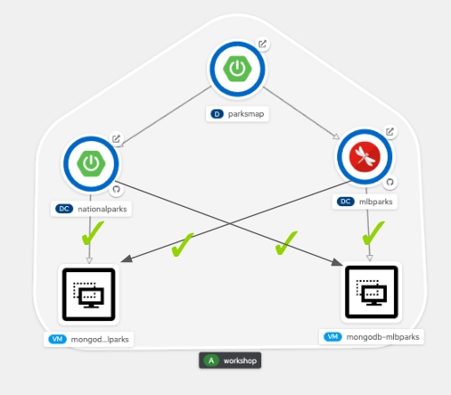
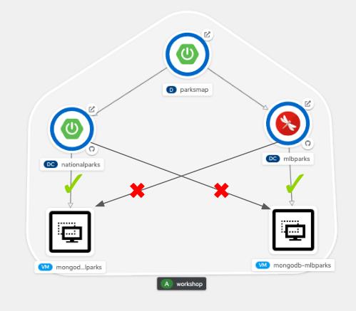

# Background: About network policy

Network policies allow you to configure isolation policies for individual pods, i.e. limiting the ability for others to access the pod. Network policies do not require administrative privileges, giving developers more control over the applications in their projects. You can use network policies to create logical zones in the SDN that map to your organisation network zones. The benefit of this approach is that the location of running pods becomes irrelevant because network policies allow you to segregate traffic regardless of where it originates. 

By default, all Pods in a project are accessible from other Pods and network endpoints. To isolate one or more pods in a project, you can create NetworkPolicy objects in that project to indicate the allowed incoming connections. Project administrators can create and delete NetworkPolicy objects within their own project. If a pod is matched by selectors in one or more NetworkPolicy objects, then the Pod will accept only connections that are allowed by at least one of those NetworkPolicy objects. A Pod that is not selected by any NetworkPolicy objects is fully accessible.

The following **example** (don't apply this, we're only showing this as an example) NetworkPolicy objects demonstrate supporting different scenarios:
- Deny all traffic:

To make a project deny by default, add a NetworkPolicy object that matches all pods but accepts no traffic:
~~~yml
kind: NetworkPolicy
apiVersion: networking.k8s.io/v1
metadata:
  name: deny-by-default
spec:
  podSelector: {}
  ingress: []
~~~
- Only allow HTTP and HTTPS traffic based on pod labels:

To enable only HTTP and HTTPS access to the pods with a specific label (role=frontend in following example), add a NetworkPolicy object similar to the following:
~~~yml
kind: NetworkPolicy
apiVersion: networking.k8s.io/v1
metadata:
  name: allow-http-and-https
spec:
  podSelector:
    matchLabels:
      role: frontend
  ingress:
  - ports:
    - protocol: TCP
      port: 80
    - protocol: TCP
      port: 443
~~~

# Exercise: Configuring network policy

By default, all pods in a project are accessible from other Pods and network endpoints. In this exercise, we'll **restrict access between pods and VMs** as seen from image below, utilising the applications that we deployed in a previous step:<br>
 


Let's verify that we currently have full unrestricted network access within our project, i.e. our "nationalparks" application can access "mongodb-mlbparks" database VM and "mlbparks" application can access to "mongodb-nationalparks" database VM - something that you may not *actually* want in a production environment, as it's an application talking to the wrong database:

1. Make sure that you're in the "Administrator perspective", and click **Workloads** → **Pods** from the side menu.

2. Click **nationalparks** pod (not the deploy pod, the one that's running).

3. Click the **Terminal** tab.

4. Run following commands and verify both mongodb services are accessible.
~~~bash
sh-4.4$ curl mongodb-mlbparks:27017
It looks like you are trying to access MongoDB over HTTP on the native driver port.
sh-4.4$ curl mongodb-nationalparks:27017
It looks like you are trying to access MongoDB over HTTP on the native driver port.
~~~

5. Repeat above steps for **mlbparks** pod.
~~~bash
sh-4.4$ curl mongodb-mlbparks:27017
It looks like you are trying to access MongoDB over HTTP on the native driver port.
sh-4.4$ curl mongodb-nationalparks:27017
It looks like you are trying to access MongoDB over HTTP on the native driver port.
~~~

The output above demonstrates unrestricted network access back/forth - all applications can contact all other databases.

Now, let's apply following network policy to restrict access to **mongodb-mlbparks** from **nationalparks**.

> **NOTE**: If the formatting breaks in the output below and it doesn't validate properly in the UI, a better place to copy these from might be the original source page, [here](https://github.com/RHFieldProductManagement/ocp4_aio_role_deploy_cnvlab/blob/main/files/lab/workshop/content/micro-segmentation.md).

1. Click **Networking** → **NetworkPolicies** from the side menu.

2. Click the **CreateNetworkPolicy** button.

3. Click **Edit YAML**.

4. Paste the following policy and click **Create**.
~~~yml
apiVersion: networking.k8s.io/v1
kind: NetworkPolicy
metadata:
  name: mlbparks-policy
  namespace:  parksmap-demo
spec:
  podSelector:
    matchLabels:
      kubevirt.io/domain: mongodb-mlbparks
  ingress:
  - from:
    - namespaceSelector:
        matchLabels:
          kubernetes.io/metadata.name:  parksmap-demo
      podSelector:
        matchLabels:
          component: mlbparks
    ports:
    - protocol: TCP
      port: 27017
~~~

Then apply following network policy to restrict access to **mongodb-nationalparks** from **mlbparks**.

1. Click **Networking** → **NetworkPolicies** from the side menu.

2. Click the **CreateNetworkPolicy** button.

3. Click **Edit YAML**.

4. Paste the following policy and click **Create**.

~~~yml
apiVersion: networking.k8s.io/v1
kind: NetworkPolicy
metadata:
  name: nationalparks-policy
  namespace: parksmap-demo
spec:
  podSelector:
    matchLabels:
      kubevirt.io/domain: mongodb-nationalparks
  ingress:
  - from:
    - namespaceSelector:
        matchLabels:
          kubernetes.io/metadata.name: parksmap-demo
      podSelector:
        matchLabels:
          component: nationalparks
    ports:
    - protocol: TCP
      port: 27017
~~~
Finally, let's verify that the "nationalparks" application can only access the "mongodb-nationalparks" database VM and the "mlbparks" application can only access the "mongodb-mlbparks" database VM:

1. Click **Workloads** → **Pods** from the side menu.

2. Click **nationalparks** pod (not the deploy VM - the one that's running)

3. Click the **Terminal** tab.

4. Run following commands and verify both mongodb services are accessible.

   > Note: curl's timeout is greater than 60 seconds. If you'd like to increase that add a `-m 5` to change it to five seconds (or another value of your choosing).
~~~bash
sh-4.4$ curl mongodb-nationalparks:27017
It looks like you are trying to access MongoDB over HTTP on the native driver port.
sh-4.4$ curl mongodb-mlbparks:27017
curl: (7) Failed to connect to mongodb-mlbparks port 27017: Connection timed out
sh-4.4$ 
~~~

5. Repeat above steps for **mlbparks** pod.

```bash
sh-4.2$ curl mongodb-mlbparks:27017
It looks like you are trying to access MongoDB over HTTP on the native driver port.
sh-4.2$ curl mongodb-nationalparks:27017
curl: (7) Failed connect to mongodb-nationalparks:27017; Connection timed out
sh-4.2$ 
```

That's it! We're done! I hope you've enjoyed attending this lab. Any questions, please let us know! :-)
