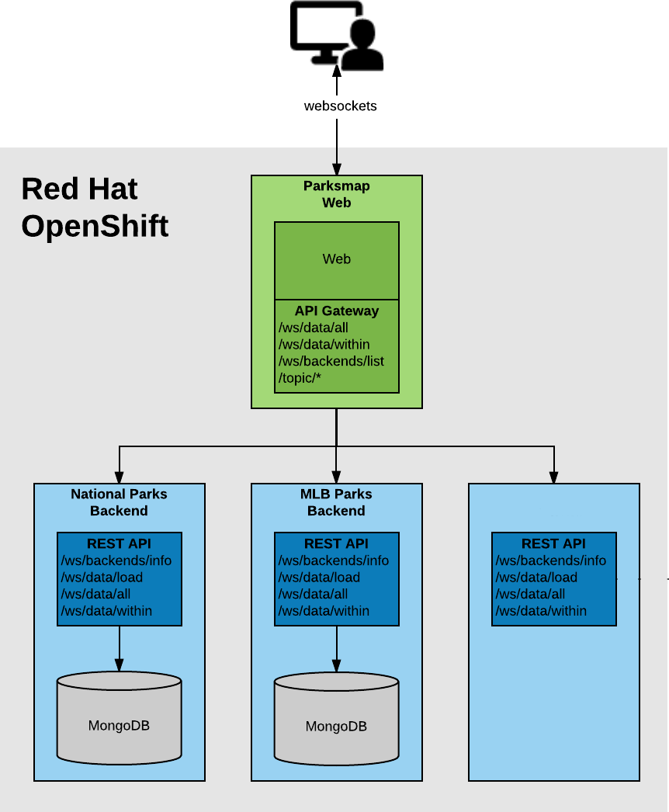

This lab introduces you to the architecture of the ParksMap application used throughout this workshop, to get a better understanding of the things you'll be doing from a developer perspective. ParksMap is a polyglot geo-spatial data visualization application built using the microservices architecture and is composed of a set of services which are developed using different programming languages and frameworks.



The main service is a web application which has a server-side component in charge of aggregating the geo-spatial APIs provided by multiple independent backend services and a client-side component in JavaScript that is responsible for visualizing the geo-spatial data on the map. The client-side component which runs in your browser communicates with the server-side via WebSockets protocol in order to update the map in real-time.

There will be a set of independent backend services deployed that will provide different mapping and geo-spatial information. The set of available backend services that provide geo-spatial information are:

* WorldWide National Parks
* Major League Baseball Stadiums in North America

The original source code for this application is available [here](https://github.com/openshift-roadshow/parksmap-web).

The server-side component of the ParksMap web application acts as a communication gateway to all the available backends. These backends will be dynamically discovered by using service discovery mechanisms provided by OpenShift which will be discussed in more details in the following labs.

The backend applications use MongoDB to persist map and geo-spatial information. In order to showcase how containers and virtual machines can run together in an OpenShift Environment, you will be deploying MongoDB applications as virtual machines.

### Retrieve kubeadmin password

For the parksmap labs we're going to be using the `kubeadmin` login for the OpenShift web console. This is necessary as we've not enabled the extra permissions to access the VM machine consoles to the lab user. To retrive the `kubeadmin` password do the following:

From within this lab guide, SSH to the bastion node:

```execute-1
ssh %bastion-username%@%bastion-host%
```

When you see the prompt, agree to the SSH certificates by typing "yes", and then enter **%bastion-password%** as the password. Then you can execute following command to get the kubeadmin password:

```execute-1
echo $(cat %kubeadmin-password-file%)
```

Note the password (or copy it) and exit the ssh session:

```execute-1
exit
```

> **NOTE**: Make sure that you exit from this session before proceeding!

```execute-1
oc whoami
```

The above output should show "**system:serviceaccount:workbook:cnv**", if it doesn't or it shows "**system:admin**" you've not yet disconnected from the session.

Once you've done this you can proceed to the lab.