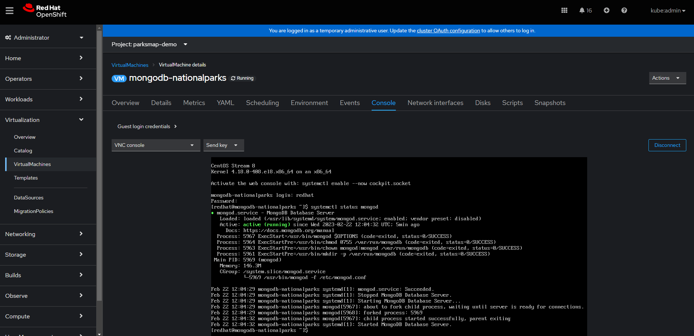
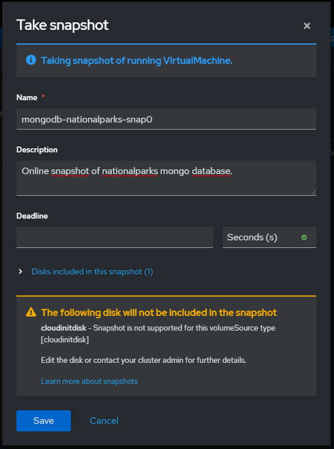
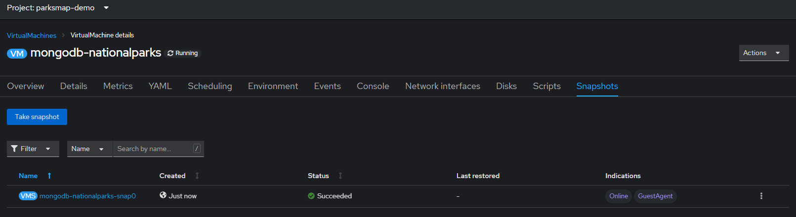
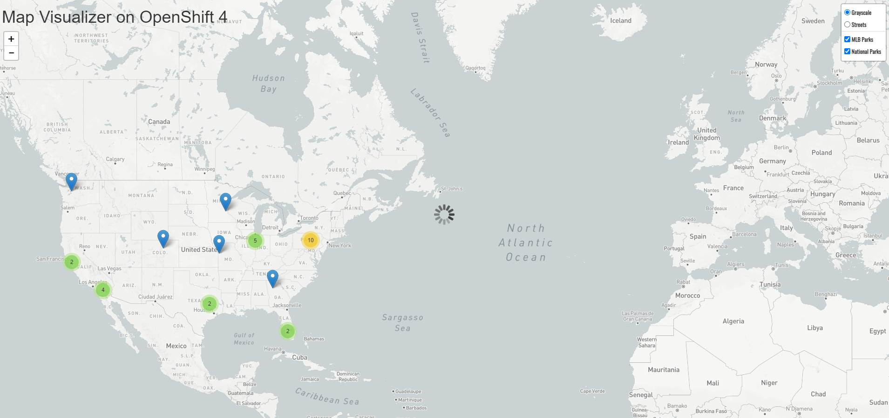
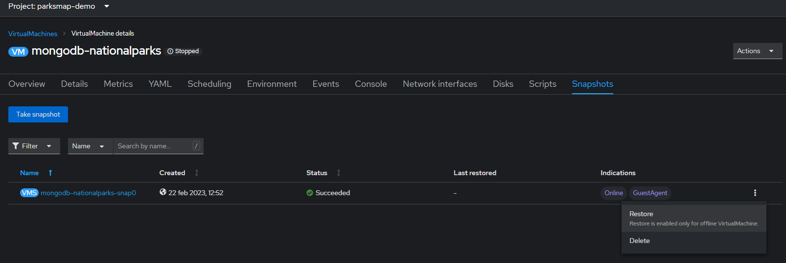
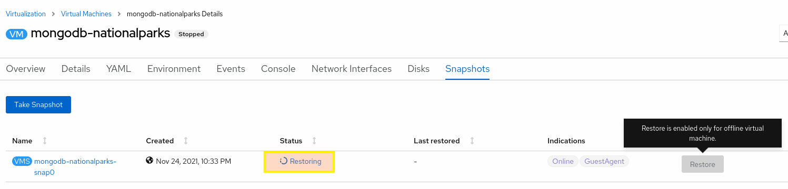
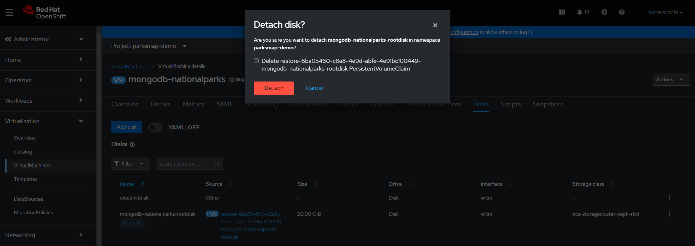

### Background: Virtual Machine Snapshots

A snapshot represents the state and data of a virtual machine (VM) at a specific point in time. You can use a snapshot to restore an existing VM to a previous state (represented by the snapshot) for backup and disaster recovery, or to rapidly roll back to a previous development version. You can create and delete virtual machine (VM) snapshots for VMs, whether the VMs are powered off (**offline**) or on (**online**).

In OpenShift Virtualization, when taking a snapshot of a *running* VM, the controller checks that the **QEMU guest agent** is installed and running. If so, it freezes (quiesce) the file system before taking the snapshot, and thaws the file system after the snapshot is taken, allowing for crash-consistent backups. The snapshot stores a copy of each Container Storage Interface (CSI) volume attached to the VM, and a copy of the VM specification and metadata. Snapshots cannot be changed after creation.

With the VM snapshots feature, cluster administrators and application developers can:
- Create a new snapshot
- List all snapshots attached to a specific VM
- Restore a VM from a snapshot
- Delete an existing VM snapshot

OpenShift Virtualization supports VM snapshots on the following:
- Red Hat OpenShift Container Storage
- Any other storage provider with the Container Storage Interface (CSI) driver that supports the *Kubernetes Volume Snapshot API*

### Exercise: Installing QEMU guest agent

To create snapshots of an online (Running state) VM with the highest integrity, we need to install the QEMU guest agent. The QEMU guest agent takes a consistent snapshot by attempting to quiesce the VM’s file system. This ensures that in-flight I/O is written to the disk before the snapshot is taken. If the guest agent is not present, quiescing is not possible and a "best-effort" snapshot is taken. The conditions under which the snapshot was taken are reflected in the snapshot indications that are displayed in the web console or CLI.

> **NOTE**: The qemu-guest-agent is widely available and available by default in Red Hat virtual machines. It might be already installed and enabled on the virtual machine used in this lab module, but we'll quickly show you how to install and enable it.

1. Navigate to the **dedicated OpenShift Web UI** (%cnvlab-console-url%) so we can access the console of the `mongodb-nationalparks` virtual machine. From the "**Administrator**" view, you'll need to select "**Virtualization**" → "**Virtual Machines**" → "**mongodb-nationalparks**" → "**Console**". You'll be able to login with "**redhat/openshift**" (if you are not already logged), noting that you may have to click on the console window for it to capture your input:



> **TIP**: You might find `Serial Console` option is more responsive.

> **NOTE**: If you don't see an VMs make sure to change to the **parksmap-demo** project via the drop down at the top of the console.

2. Once you're in the virtual machine's console install the QEMU guest agent on the virtual machine:
```copy
sudo yum install -y qemu-guest-agent
```

3. Ensure the service is persistent and start it
```copy
sudo systemctl enable --now qemu-guest-agent
```

### Exercise: Creating a virtual machine snapshot in the web console

Virtual machine (VM) snapshots can be created either by using the **Web Console we opened in a tab** (%cnvlab-console-url%), or in the CLI. In this exercise, let's create a snapshot of our MongoDB database VM by using the web console:
<table>
  <tr>
    <td>

1. Click **Virtualization** from the side menu.
   
2. Click the **Virtual Machines** tab (if it's not already selected).
   
3. Select **mongodb-nationalparks** virtual machine to open its **Overview** screen.

4. Click the **Snapshots** tab and then click **Take Snapshot**.

5. Fill in the **Snapshot Name** (call it whatever you like) and optional **Description** fields.

6. Click **Save**.
   </td>
   <td></td>
    </tr>
    </table>

Once you click "**Save**" to create snapshot, the VM controller checks that the QEMU guest agent is installed and running. If so, it freezes the VM file system before taking the snapshot, and initiates snapshot creation on actual storage system for each Container Storage Interface (CSI) volume attached to the VM, a copy of the VM specification and metadata is also created. It should take just a few seconds to actually create the snapshot and make it "**Ready**" to use. Once the snapshot becomes **Ready** then it can be used to restore the virtual machine to that specific point in time then the snapshot is taken.



### Exercise: Destroy database

After taking an online snapshot of the database VM, let's destroy the database by forcefully deleting everything under it's data path.

1. From the "**Administrator**" view, you'll need to select "**Virtualization**" → "**Virtual Machines**" → "**mongodb-nationalparks**" → "**Console**" again. You'll be able to login with "**redhat/openshift**" (if you are not already logged), noting that you may have to click on the console window for it to capture your input.

2. Once you're in the virtual machine, delete everything under it's data path.
```copy
sudo systemctl stop mongod
```
```copy
sudo rm -rf /var/lib/mongo/*
```
```copy
sudo systemctl start mongod
```

Now you can check by refreshing `ParksMap` [web page](http://parksmap-%parksmap-project-namespace%.%cluster_subdomain%), it should now **fail** to load national parks locations from the backend service and no longer display them on the map. MLB Parks should still be fine (check the USA map for these) as these come from the other MongoDB database VM:



### Exercise: Restoring a virtual machine from a snapshot in the web console

In this exercise, let's restore our MongoDB database VM by using the web console (%cnvlab-console-url%) to the snapshot created in the previous exercise. You can only restore to a powered off (offline) VM so we will first power off the virtual machine in this exercise.

1. Click **Virtualization** from the side menu.
2. Click the **Virtual Machines** tab (if you're not already on it).
3. Select **mongodb-nationalparks** virtual machine to open its **Overview** screen.
4. If the **mongodb-nationalparks** virtual machine is running click **Actions** → **Stop** to power it down.
5. Wait for the machine to display a "**Stopped**" status 
6. Click the **Snapshots** tab. The page displays a list of snapshots associated with the virtual machine.
6. Identify the snapshot you want to apply and select **Restore** by clicking on the three dots on the right side of the snapshot.



7. In the confirmation pop-up window, click **Restore** to restore the VM to its previous configuration represented by the snapshot.

Once you click Restore to restore vm from the snapshot, it initiates snapshot restoration on actual storage system for each Container Storage Interface (CSI) volume attached to the VM and included in the snaphot, VM specification and metadata is also restored. It should take just a few seconds to actually restore the snapshot and make the VM ready to be powered on again - don't be alarmed if this process happens instantly; we're relying on the storage capabilities of Ceph behind the scenes to do this for us and it's incredible efficient with snapshots:

<br>

After the snapshot was restored successfully navigate again to the **mongodb-nationalparks** virtual machine and click **Actions** → **Start** to power it on. Once the VM is powered on and boots successfully, you can refresh `ParksMap` the [web page](http://parksmap-%parksmap-project-namespace%.%cluster_subdomain%). It should now successfully load national parks locations again from the restored backend service and start displaying them on the map again, but please note it may take a few minutes for the VM to start up and for MongoDB to start serving data again.

### Background: Virtual machine snapshot controller and custom resource definitions (CRDs)

The VM snapshot feature introduces three new API objects defined as CRDs for managing snapshots:

- `VirtualMachineSnapshot`: Represents a user request to create a snapshot. It contains information about the current state of the VM.

- `VirtualMachineSnapshotContent`: Represents a provisioned resource on the cluster (a snapshot). It is created by the VM snapshot controller and contains references to all resources required to restore the VM.

- `VirtualMachineRestore`: Represents a user request to restore a VM from a snapshot.

The VM snapshot controller binds a `VirtualMachineSnapshotContent` object with the `VirtualMachineSnapshot` object for which it was created, with a one-to-one mapping.

### Exercise: Creating an virtual machine snapshot in the CLI

In previous exercises in this module, we created and restored a VM snapshot in the OpenShift web console. However, It's also possible to do same operations in the CLI using the CRDs above. Using CLI and yaml/json definitions of `VirtualMachineSnapshot` and `VirtualMachineRestore` objects to create and restore snapshot respectively, allows automating all snapshot releated operations.

In this exercise, let's create another snapshot of our mongodb database vm, this time by using the cli.

1. List the existing snapshots in the project.
```execute
oc get vmsnapshots
```
Which should show the following (or similar, depending on what you named your original snapshot):

~~~bash
NAME                          SOURCEKIND       SOURCENAME              PHASE       READYTOUSE   CREATIONTIME   ERROR
mongodb-nationalparks-snap0   VirtualMachine   mongodb-nationalparks   Succeeded   true         1h            
~~~

2. Create the `VirtualMachineSnapshot` resource. The snapshot controller creates a `VirtualMachineSnapshotContent` object, binds it to the `VirtualMachineSnapshot` and updates the **status** and **readyToUse** fields of the VirtualMachineSnapshot object. The name of the new vm snapshot will be `mongodb-nationalparks-snap1` in this example.

```execute-1
cat << EOF | oc apply -f -
apiVersion: snapshot.kubevirt.io/v1alpha1
kind: VirtualMachineSnapshot
metadata:
  name: mongodb-nationalparks-snap1 
spec:
  source:
    apiGroup: kubevirt.io
    kind: VirtualMachine
    name: mongodb-nationalparks 
EOF
```
Which should then show:

~~~bash
virtualmachinesnapshot.snapshot.kubevirt.io/mongodb-nationalparks-snap1 created
~~~

3. **Optional**: As in the previous exercise, the snapshot creation will take a few seconds in the background, and you can use the wait command and monitor the status of the snapshot, although this may immediately signal that the condition has been met, which is confirmation that the snapshot has been successfully taken.
```execute
oc wait vmsnapshot mongodb-nationalparks-snap1 --for condition=Ready
```

4. List the existing snapshots in the project again to verify that the new vm snapshot is created successfully:
```execute
oc get vmsnapshots
```
This should now show two snapshots, one you just created via the CLI, and the other the one we created via the UI earlier:

~~~bash
NAME                          SOURCEKIND       SOURCENAME              PHASE       READYTOUSE   CREATIONTIME   ERROR
mongodb-nationalparks-snap0   VirtualMachine   mongodb-nationalparks   Succeeded   true         1h            
mongodb-nationalparks-snap1   VirtualMachine   mongodb-nationalparks   Succeeded   true         9s             
~~~

5. You can also verify that the `VirtualMachineSnapshot` object is created and bound with `VirtualMachineSnapshotContent` by describing it. The `readyToUse` flag must be set to `true`.
```execute
oc describe vmsnapshot mongodb-nationalparks-snap1
```

Which should show:

~~~bash
Name:         mongodb-nationalparks-snap1
Namespace:    parksmap-demo
Labels:       <none>
Annotations:  <none>
API Version:  snapshot.kubevirt.io/v1alpha1
Kind:         VirtualMachineSnapshot
Metadata:
  Creation Timestamp:  2023-02-22T13:18:09Z
  Finalizers:
    snapshot.kubevirt.io/vmsnapshot-protection
  Generation:  5
  Managed Fields:
    API Version:  snapshot.kubevirt.io/v1alpha1
    Fields Type:  FieldsV1
    fieldsV1:
      f:metadata:
        f:annotations:
          .:
          f:kubectl.kubernetes.io/last-applied-configuration:
      f:spec:
        .:
        f:source:
          .:
          f:apiGroup:
          f:kind:
          f:name:
    Manager:      kubectl-client-side-apply
    Operation:    Update
    Time:         2023-02-22T13:18:09Z
    API Version:  snapshot.kubevirt.io/v1alpha1
    Fields Type:  FieldsV1
    fieldsV1:
      f:metadata:
        f:finalizers:
          .:
          v:"snapshot.kubevirt.io/vmsnapshot-protection":
      f:status:
        .:
        f:conditions:
        f:creationTime:
        f:indications:
          .:
          v:"GuestAgent":
          v:"Online":
        f:phase:
        f:readyToUse:
        f:sourceUID:
        f:virtualMachineSnapshotContentName:
    Manager:         virt-controller
    Operation:       Update
    Time:            2023-02-22T13:18:11Z
  Resource Version:  3351250
  UID:               f0c977b3-d008-4878-8819-b1acb023fafb
Spec:
  Source:
    API Group:  kubevirt.io
    Kind:       VirtualMachine
    Name:       mongodb-nationalparks
Status:
  Conditions:
    Last Probe Time:       <nil>
    Last Transition Time:  2023-02-22T13:18:12Z
    Reason:                Operation complete
    Status:                False
    Type:                  Progressing
    Last Probe Time:       <nil>
    Last Transition Time:  2023-02-22T13:18:12Z
    Reason:                Operation complete
    Status:                True
    Type:                  Ready
  Creation Time:           2023-02-22T13:18:12Z
  Indications:
    Online
    GuestAgent
  Phase:                                  Succeeded
  Ready To Use:                           true
  Source UID:                             ce5b2d64-d1dd-4f05-8afa-3529f1133130
  Virtual Machine Snapshot Content Name:  vmsnapshot-content-f0c977b3-d008-4878-8819-b1acb023fafb
Events:
  Type    Reason                                         Age    From                 Message
  ----    ------                                         ----   ----                 -------
  Normal  SuccessfulVirtualMachineSnapshotContentCreate  4m58s  snapshot-controller  Successfully created VirtualMachineSnapshotContent vmsnapshot-content-f0c977b3-d008-4878-8819-b1acb023fafb
~~~

6. `VirtualMachineSnapshotContent` objects represent a provisioned resource on the cluster, a VM snapshot in our case. It is created by the VM snapshot controller and contains references to all resources required to restore the VM. The underlying Kubernetes StorageClass, PersistentVolume(s), VolumeSnapshot objects used and created for each attached disk, and VM's metadata information is stored in the `VirtualMachineSnapshotContent` object. So it contains all the information needed to restore the VM to that specific point in time that snapshot is taken. You can see these details by describing the `VirtualMachineSnapshotContent` bound to our VM snapshot. This value for your environment is provided at the bottom of the previous command. Remember to change the vmsnapshotcontent name:
 
```copy
oc describe vmsnapshotcontent vmsnapshot-content-f0c977b3-d008-4878-8819-b1acb023fafb
```

### Exercise: Delete the VM's boot disk

To see how to restore the VM in the CLI, let's delete the VM's boot disk completely this time after powering of the VM.

1. Return to the **web console** (%cnvlab-console-url%) briefly and click **Virtualization** from the side menu.

2. Click the **Virtual Machines** tab.

3. Select `mongodb-nationalparks` virtual machine to open its **Overview** screen.

4. If the virtual machine is running, click **Actions** → **Stop** to power it down.

5. Click the **Disks** tab. The page displays a list of disks attached to the virtual machine.

6. Select the **disk** named `mongodb-nationalparks-rootdisk` which is the boot disk of our database VM, and click the Options menu  and select **Detach**.

7. In the confirmation pop-up window, select the **Delete restore-...** checkbox and click **Detach** to delete the disk completely.

<br>

Now you can check by refreshing `ParksMap` [web page](http://parksmap-%parksmap-project-namespace%.%cluster_subdomain%), and as before it should **fail** to load national parks locations from the backend service and no longer display them on the map.

# Exercise: Restore the VM's boot disk

In this exercise, let's restore our MongoDB database VM (by using the CLI) to the snapshot created in the previous exercise.

1. List the existing vmrestore objects in the project. There should be already a `vmrestore` object in the project because we initiated one in the previous exercise using the web console.
```execute
oc get vmrestores
```
Which should show the following, although don't be alarmed if you have multiple here - perhaps you clicked the "Restore" button multiple times in the UI previously:

~~~bash
NAME                                                TARGETKIND       TARGETNAME              COMPLETE   RESTORETIME   ERROR
mongodb-nationalparks-snap0-restore-1677071555347   VirtualMachine   mongodb-nationalparks   true       1h           
~~~

2. Create a `VirtualMachineRestore` object that specifies the name of the VM we want to restore and the name of the snapshot to be used as the source. The name of the VM and it's snapshot will be `mongodb-nationalparks` and `mongodb-nationalparks-snap1` in this example respectively. Right after creating the `VirtualMachineRestore` object, the snapshot controller updates the status fields of the VirtualMachineRestore object and replaces the existing VM configuration with the snapshot content.
```execute-1
cat << EOF | oc apply -f -
apiVersion: snapshot.kubevirt.io/v1alpha1
kind: VirtualMachineRestore
metadata:
  name: mongodb-nationalparks-vmrestore1
spec:
  target:
    apiGroup: kubevirt.io
    kind: VirtualMachine
    name: mongodb-nationalparks
  virtualMachineSnapshotName: mongodb-nationalparks-snap1
EOF
```
Which should show that the `virtualmachinerestore` object has been created:

~~~bash
virtualmachinerestore.snapshot.kubevirt.io/mongodb-nationalparks-vmrestore1 created
~~~

3. **Optional**: As in the previous exercise, the VM restoration will take a little seconds in the background. You can use the wait command and monitor the status of the snapshot.
```execute
oc wait vmrestore mongodb-nationalparks-vmrestore1 --for condition=Ready
```

4. List the existing vm restore objects in the project again to verify that the new vm restore is created successfully. If the vm restored successfully then the `complete` flag must be set to `true`. 
~~~execute-1
oc get vmrestores
~~~
Which should now show our latest one as "**complete=true**":

~~~bash
NAME                                                TARGETKIND       TARGETNAME              COMPLETE   RESTORETIME   ERROR
mongodb-nationalparks-vmrestore1                    VirtualMachine   mongodb-nationalparks   true       40s
resotre-mongodb-nationalparks-snap0-1677071555347   VirtualMachine   mongodb-nationalparks   true       78m     
~~~

5. You can also describe the `VirtualMachineRestore` object to see additional details such as operation start/end times, disks restored, etc. The `Complete` flag must be set to `true`.
```execute
oc describe vmsnapshot mongodb-nationalparks-snap1
```
Which should then show:

~~~bash
Name:         mongodb-nationalparks-vmrestore1
Namespace:    parksmap-demo
Labels:       <none>
Annotations:  <none>
API Version:  snapshot.kubevirt.io/v1alpha1
Kind:         VirtualMachineRestore
Metadata:
  Creation Timestamp:  2023-02-22T14:30:52Z
  Generation:          6
  Managed Fields:
    API Version:  snapshot.kubevirt.io/v1alpha1
    Fields Type:  FieldsV1
    fieldsV1:
      f:metadata:
        f:annotations:
          .:
          f:kubectl.kubernetes.io/last-applied-configuration:
      f:spec:
        .:
        f:target:
          .:
          f:apiGroup:
          f:kind:
          f:name:
        f:virtualMachineSnapshotName:
    Manager:      kubectl-client-side-apply
    Operation:    Update
    Time:         2023-02-22T14:30:52Z
    API Version:  snapshot.kubevirt.io/v1alpha1
    Fields Type:  FieldsV1
    fieldsV1:
      f:metadata:
        f:ownerReferences:
          .:
          k:{"uid":"ce5b2d64-d1dd-4f05-8afa-3529f1133130"}:
      f:status:
        .:
        f:complete:
        f:conditions:
        f:restoreTime:
        f:restores:
    Manager:    virt-controller
    Operation:  Update
    Time:       2023-02-22T14:30:53Z
  Owner References:
    API Version:           kubevirt.io/v1
    Block Owner Deletion:  true
    Controller:            true
    Kind:                  VirtualMachine
    Name:                  mongodb-nationalparks
    UID:                   ce5b2d64-d1dd-4f05-8afa-3529f1133130
  Resource Version:        3437475
  UID:                     12def206-9285-49be-8540-2a813d110e97
Spec:
  Target:
    API Group:                    kubevirt.io
    Kind:                         VirtualMachine
    Name:                         mongodb-nationalparks
  Virtual Machine Snapshot Name:  mongodb-nationalparks-snap1
Status:
  Complete:  true
  Conditions:
    Last Probe Time:       <nil>
    Last Transition Time:  2023-02-22T14:30:53Z
    Reason:                Operation complete
    Status:                False
    Type:                  Progressing
    Last Probe Time:       <nil>
    Last Transition Time:  2023-02-22T14:30:53Z
    Reason:                Operation complete
    Status:                True
    Type:                  Ready
  Restore Time:            2023-02-22T14:30:53Z
  Restores:
    Data Volume Name:         restore-12def206-9285-49be-8540-2a813d110e97-mongodb-nationalparks-rootdisk
    Persistent Volume Claim:  restore-12def206-9285-49be-8540-2a813d110e97-mongodb-nationalparks-rootdisk
    Volume Name:              mongodb-nationalparks-rootdisk
    Volume Snapshot Name:     vmsnapshot-f0c977b3-d008-4878-8819-b1acb023fafb-volume-mongodb-nationalparks-rootdisk
Events:
  Type    Reason                         Age   From                Message
  ----    ------                         ----  ----                -------
  Normal  VirtualMachineRestoreComplete  3m7s  restore-controller  Successfully completed VirtualMachineRestore mongodb-nationalparks-vmrestore1
~~~


You'll know the snapshot is restored syccesfsfully when it's `complete` flag is set to `true`:

```execute-1
oc describe vmsnapshot mongodb-nationalparks-snap1 | grep true
```


You can now start your VM back up. From the console go to the **mongodb-nationalparks** virtual machine and select **Actions** → **Start** to power the VM on, and you will have likely noticed that the root disk has been automatically reattached. Once the VM is powered on and boots successfully, you can refresh `ParksMap` [web page](http://parksmap-%parksmap-project-namespace%.%cluster_subdomain%), again after a few minutes of boot-up time it should successfully load national parks locations from the backend service and start displaying them on the map again.

That's it for taking VM snapshots and performing restores - we've created snapshots of our MongoDB database VM using both the OpenShift web console and CLI, and restored it after both deleting data files on the root disk and removing the underlying VM disk entirely. Select "**Hot-plug**" below to continue.
