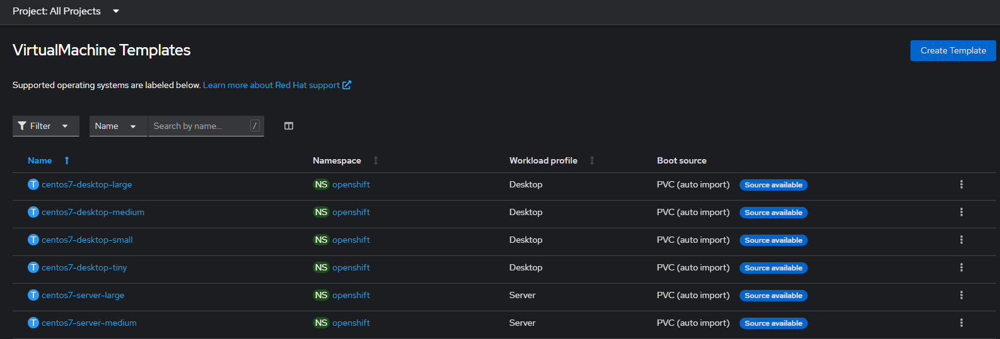
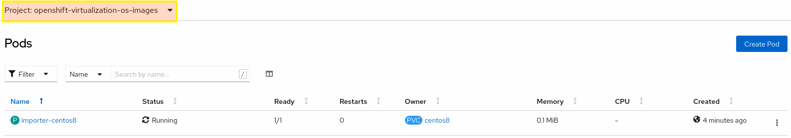
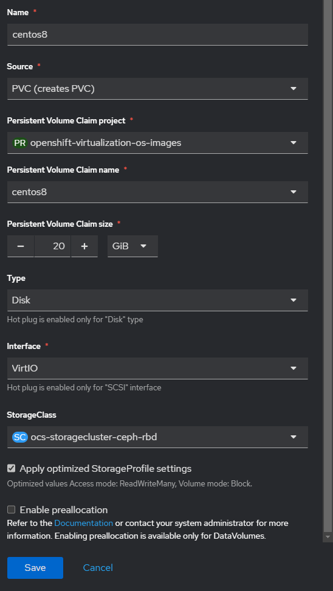

## About virtual machine templates and boot sources

Virtual machines consist of a virtual machine definition and one or more disks that are backed by data volumes. Virtual machine templates enable you to create virtual machines using predefined virtual machine specifications, allowing for subsequent, repeated creation of similar virtual machines.

Every virtual machine template requires a **boot source**, which is a fully configured virtual machine disk image including configured drivers. Each virtual machine template contains a virtual machine definition with a pointer to the boot source. Each boot source has a predefined name and namespace. For some operating systems, a boot source is automatically provided. If it is not provided, then an administrator must prepare a custom boot source.

The namespace `openshift-virtualization-os-images` houses these templates and is installed with the OpenShift Virtualization Operator. Once the boot source feature is installed, you can create boot sources, attach them to templates, and create virtual machines from the templates.

Boot sources are defined by using a persistent volume claim (PVC) that is populated by uploading a local file, cloning an existing PVC, importing from a registry, or by URL. Attach a boot source to a virtual machine template by using the web console. After the boot source is attached to a virtual machine template, you create any number of fully configured ready-to-use virtual machines from the template.

Back in our **dedicated Web Console tab** (%cnvlab-console-url%), we can see all the preconfigured Red Hat virtual machine templates listed in the **Templates** tab within the **Virtualization** menu entry. These templates are available for different versions of Red Hat Enterprise Linux, Fedora, Microsoft Windows 10, and Microsoft Windows Servers. Each Red Hat virtual machine template is preconfigured with the operating system image, default settings for the operating system, flavor (CPU and memory), and workload type (server).

</td>

## Exercise: Importing a CentOS Stream 8 image as a boot source
There are four methods for selecting and adding a boot source in the web console:
- **Upload local file** (creates PVC)
- **Import via URL** (creates PVC)
- **Clone existing PVC** (creates PVC)
- **Import via Registry** (creates PVC)

In this exercise, we will use the **Import Via URL** method to import a CentOS Stream 8 qcow2 disk image from our internal http server. Whilst we've done this before with the CLI, this time we will use the OpenShift web console to designate an image and in the background a new PVC will be created and CDI will be used to import the disk image into the newly created PVC. Due to current limitations in this bookbag, the virtualization tab doesn't show up in the console tab; we will therefore have to use the full Openshift console: %cnvlab-console-url%.

The new PVC will then be set as the boot source of the selected CentOS 8 template and then cloned for each new virtual machine created using that template.

1. In the upper-left part of the console, select the **openshift-virtualization-os-images** project as shown below. If the project is not shown, enable **Show default projects**:

3. then go to **Storage** side menu and create a **PersistentVolumeClaim** using the Form
4. Select **Edit YAML** and enter the following informations :
```copy
apiVersion: v1
kind: PersistentVolumeClaim
metadata:
  name: "centos8"
  labels:
    app: containerized-data-importer
  annotations:
    cdi.kubevirt.io/storage.import.endpoint: "http://192.168.123.100:81/rhel8-kvm.img"
spec:
  volumeMode: Block
  storageClassName: ocs-storagecluster-ceph-rbd
  accessModes:
  - ReadWriteMany
  resources:
    requests:
      storage: 20Gi
```

Once you click **Save** a new `PersistentVolumeClaim` of the specified size is automatically provisioned using the selected storage class, which is ceph-rbd in this exercise.

After creating the new `PersistentVolumeClaim`, a CDI (Containerized Data Importer) pod is started in the `openshift-virtualization-os-images` namespace. This CDI pod downloads the specified disk image from the http URL and populates the newly created `PersistentVolumeClaim` with the contents of that disk image. You can see this CDI pod by switching into the `openshift-virtualization-os-images` project and selecting **Workloads** → **Pods** from the side menu.



You can also view the import progress by listing the data volumes in the `openshift-virtualization-os-images` namespace.

```execute
oc get datavolumes -n openshift-virtualization-os-images
```

Which should show the following:

~~~bash
NAME        PHASE              PROGRESS   RESTARTS   AGE
centos8     ImportInProgress   2.00%                 7m28s
~~~

3. Click **Create** then wait a few minutes for the volume to get created from the provided image
4. In the OpenShift Virtualization console, click **Virtualization** from the side menu.
5. Click the **Templates** tab.
6. Click **Create Template** and paste the following content, then click **Create** :
```copy
apiVersion: template.openshift.io/v1
kind: Template
metadata:
  name: centos8
  labels:
    template.kubevirt.io/type: vm
    os.template.kubevirt.io/centos8: 'true'
    workload.template.kubevirt.io/server: 'true'
  annotations:
    name.os.template.kubevirt.io/centos8: CentOS 8 or higher
    description: CentOS 8 VM
    openshift.io/display-name: CentOS 8.0+ VM
    iconClass: icon-fedora
  namespace: default
objects:
  - apiVersion: kubevirt.io/v1
    kind: VirtualMachine
    metadata:
      name: '${NAME}'
      annotations:
        description: CentOS 8.0+ VM
      labels:
        app: '${NAME}'
        vm.kubevirt.io/template: centos8
        os.template.kubevirt.io/centos8: 'true'
    spec:
      running: false
      template:
        metadata:
          annotations:
            vm.kubevirt.io/flavor: small
            vm.kubevirt.io/os: centos8
            vm.kubevirt.io/workload: server
          labels:
            kubevirt.io/domain: '${NAME}'
            kubevirt.io/size: small
        spec:
          domain:
            cpu:
              cores: 1
              sockets: 1
              threads: 1
            devices:
              disks:
                - disk:
                    bus: virtio
                  name: rootdisk
                - disk:
                    bus: virtio
                  name: cloudinitdisk
              interfaces:
                - masquerade: {}
                  model: virtio
                  name: default
              networkInterfaceMultiqueue: true
              rng: {}
            features:
              acpi: {}
              smm:
                enabled: true
            firmware:
              bootloader:
                efi: {}
            machine:
              type: q35
            resources:
              requests:
                memory: 2Gi
          hostname: '${NAME}'
          networks:
            - name: default
              pod: {}
          terminationGracePeriodSeconds: 180
          volumes:
            - name: rootdisk
              containerDisk:
                image: 'quay.io/containerdisks/centos-stream:8'
            - cloudInitNoCloud:
                userData: |-
                  #cloud-config
                  password: '${CLOUD_USER_PASSWORD}'
                  chpasswd: { expire: False }
              name: cloudinitdisk
parameters:
  - name: NAME
    description: Name for the new VM
    generate: expression
    from: 'example-[a-z0-9]{16}'
  - name: CLOUD_USER_PASSWORD
    description: Randomized password for the cloud-init user
    generate: expression
    from: '[a-z0-9]{4}-[a-z0-9]{4}-[a-z0-9]{4}'
```
7. Go to the **Disks** tab and edit the rootdisk definition
8. Rename it from **rootdisk** to **centos8**
9. in the **Source** field, select **PVC (Creates PVC)**
10. In the **Persistent Volume Claim Project** field select **openshift-virtualization-os-images**
11. In the **Persistent Volume Claim Name** you shouild nbow find the centos8 pvc we created earlyer
12. Set **Persistent Volume Claim size** as **20 GiB**. This will also be the size of the root disk of the VMs created by using this template.




8. Click **Save**.


You can now use this template to create CentOS 8 virtual machines.

That's it for adding boot sources to a template. We have imported a CentOS 8 cloud disk image into a new PVC and attached that onto a CentOS 8 virtual machine template which we will use to create new virtual machines in the next labs. Let's continue on by selecting the "**Parksmap Application**" button below.
