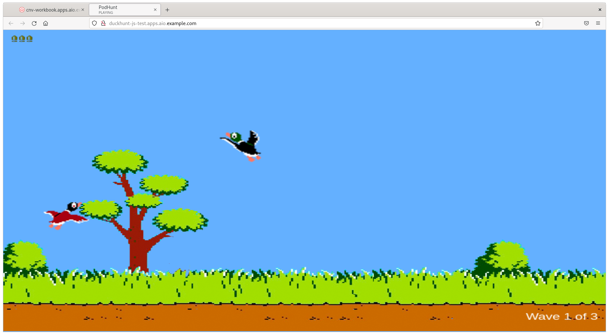

Before we begin, it's important to make sure that we're in the CLI view, so select the "**Terminal**" button at the top of the screen if it's not already selected. We also need to make sure that we're disconnected from the bastion machine that we connected to in a previous window, so make sure that you're the correct user:

```execute
oc whoami
```
This should return "**system:serviceaccount:workbook:cnv**". If it doesn't, select the menu from the top right hand corner and choose "**Reload Terminal**". This should take you right back to the beginning. Now you should be ready to continue...

On the right hand side where the web terminal is, let's see if we can execute the following:

```execute
oc get nodes
```

You should be able to see the list of nodes as below:

~~~bash
NAME                           STATUS   ROLES                  AGE   VERSION
ocp4-master1.aio.example.com   Ready    control-plane,master   18h   v1.25.4+77bec7a
ocp4-master2.aio.example.com   Ready    control-plane,master   18h   v1.25.4+77bec7a
ocp4-master3.aio.example.com   Ready    control-plane,master   18h   v1.25.4+77bec7a
ocp4-worker1.aio.example.com   Ready    worker                 18h   v1.25.4+77bec7a
ocp4-worker2.aio.example.com   Ready    worker                 18h   v1.25.4+77bec7a
ocp4-worker3.aio.example.com   Ready    worker                 18h   v1.25.4+77bec7a
~~~

If you do **NOT** see **three** masters and **three** workers listed in your output, you may need to approve the CSR requests. Again, note that <u>you only need to do this if you're missing nodes</u>, but it won't harm to run this regardless:

```execute
for csr in $(oc get csr | awk '/Pending/ {print $1}'); \
    do oc adm certificate approve $csr; done
```

If all the nodes are ready, the output will be *No resources found*. Then, if there are Pending ones, you should see an output similar to below:
~~~bash
certificatesigningrequest.certificates.k8s.io/csr-26rcg approved
certificatesigningrequest.certificates.k8s.io/csr-4k6n8 approved
(...)
~~~

> **NOTE**: If you needed to do this, it may take a few minutes for the worker to be in a `Ready` state, this is due to it needing to deploy all of the necessary pods. We can proceed though and it'll catch up in the background.
>
> **IMPORTANT**: If you do not have any CSR's to approve and you've still not got six nodes then it's likely that your environment has failed to deploy properly. We're trying to figure out why it very rarely does this. Please delete your environment and attempt another deployment - we apologise!

Next, let's validate the version that we've got deployed, and the status of the cluster operators:

```execute
oc get clusterversion
```

Then you should see the following (your minor version may be different, but should be no less than below):

~~~bash
NAME      VERSION   AVAILABLE   PROGRESSING   SINCE   STATUS
version   4.12.0    True        False         18h     Cluster version is 4.12.0
~~~

After that, check the cluster operators:

```execute
oc get clusteroperators
```

This command will list the all cluster operators, the main components of OpenShift itself, and their availability as shown below:

~~~bash
NAME                                       VERSION   AVAILABLE   PROGRESSING   DEGRADED   SINCE   MESSAGE
authentication                             4.12.0    True        False         False      18h
baremetal                                  4.12.0    True        False         False      18h
cloud-controller-manager                   4.12.0    True        False         False      18h
cloud-credential                           4.12.0    True        False         False      18h
cluster-autoscaler                         4.12.0    True        False         False      18h
config-operator                            4.12.0    True        False         False      18h
console                                    4.12.0    True        False         False      18h
control-plane-machine-set                  4.12.0    True        False         False      18h
csi-snapshot-controller                    4.12.0    True        False         False      18h
dns                                        4.12.0    True        False         False      18h
etcd                                       4.12.0    True        False         False      18h
image-registry                             4.12.0    True        False         False      17h
(...)
~~~

### Making sure OpenShift is fully functional

Let's now validate that OpenShift is ready for our lab by having little bit of fun. Let's build a simple web-browser based game (called Duckhunt) from source, expose it via a route, and make sure all of the networking is hooked up properly. We'll use the **s2i** (source to image) container type:

Start with creating a new project with following command:

```execute
 oc new-project test
```
Now execute following command to deploy example application:

```execute
oc new-app \
	nodejs~https://github.com/vrutkovs/DuckHunt-JS
```

This will create all Kubernetes resources to deploy and run the example application as below:

~~~bash
--> Creating resources ...
    imagestream.image.openshift.io "duckhunt-js" created
    buildconfig.build.openshift.io "duckhunt-js" created
    deployment.apps "duckhunt-js" created
    service "duckhunt-js" created
--> Success
    Build scheduled, use 'oc logs -f buildconfig/duckhunt-js' to track its progress.
    Application is not exposed. You can expose services to the outside world by executing one or more of the commands below:
     'oc expose service/duckhunt-js'
    Run 'oc status' to view your app.
~~~


Our application will now build from source, you can watch it happen by tailing the build log file. When it's finished it will push the image into the OpenShift image registry:

```execute
oc logs duckhunt-js-1-build -f
```

This process will likely take approximately 3-4 minutes for the following output to confirm the new image is pushed to registry:

~~~bash
Successfully pushed image-registry.openshift-image-registry.svc:5000/test/duckhunt-js@sha256:c4e64bc633ae09ce0f2f2f6de2ca9eaca8e11dc5b335301a2be78216df4b6929
Push successful
~~~

> **NOTE**: You may get an error saying "Error from server (BadRequest): container "sti-build" in pod "duckhunt-js-1-build" is waiting to start: PodInitializing"; you were just too quick to ask for the log output of the pods, simply re-run the command.

Once finished, check the status of the pods by executing the command below:

```execute
oc get pods 
```

You'll see that a couple of pods have been created, one that just completed our build, and then the application itself, which should be in a `Running` state, if it's still showing as `ContainerCreating` just give it a few more seconds:


~~~bash
NAME                           READY   STATUS      RESTARTS   AGE
duckhunt-js-1-build            0/1     Completed   0          4m7s
duckhunt-js-5b75fd5ccf-j7lqj   1/1     Running     0          105s   <-- this is our app!
~~~

Now expose the application (via the service) so we can route to it from the outside...


```execute
oc expose svc/duckhunt-js
```

As a result, a route is created:

~~~bash
route.route.openshift.io/duckhunt-js exposed
~~~

To check the route execute following command:

```execute
oc get route duckhunt-js
```

Now you should be able to see the route endpoint as below:

~~~bash
NAME          HOST/PORT                                  PATH   SERVICES      PORT       TERMINATION   WILDCARD
duckhunt-js   duckhunt-js-test.%cluster_subdomain%          duckhunt-js   8080-tcp                 None
~~~

You should be able to open up the application in the same browser that you're reading this guide from, either copy and paste the address, or click this link: [http://duckhunt-js-test.%cluster_subdomain%](http://duckhunt-js-test.%cluster_subdomain%). If your OpenShift cluster is working as expected and the application build was successful, you should now be able to have a quick play with this... good luck ;-)
> **NOTE**: If the link above doesn't work just run `oc get route duckhunt-js` to find the exposed route for the app. 



Before we start looking at OpenShift Virtualization, let's just clean up the test project and have OpenShift remove the resources...

```execute
oc delete project test
```
Then, wait for project deletion:

~~~bash
project.project.openshift.io "test" deleted
~~~


Now we can move onto "**Deploying CNV**".
