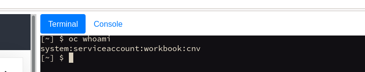

Welcome to the OpenShift Virtualization self-paced lab guide. We've put this together to give you an overview and hands-on technical deep dive into how OpenShift Virtualization works, and how it continues to bring advanced virtualisation capabilities to OpenShift.

**OpenShift Virtualization** is the product name for the Container-native Virtualization operator for OpenShift. This is often referred to as "**CNV**" and is the downstream offering for the upstream [Kubevirt project](https://kubevirt.io/). While some aspects of this lab have references to "CNV", any reference to "CNV", "Container-native Virtualization" and "OpenShift Virtualization" can be *somewhat* used interchangeably.

In these labs you'll utilise a virtual environment built with the [OpenShift AIO](https://github.com/RHFieldProductManagement/openshift-aio) concept that mimics as close as feasibly possible a **real** [baremetal IPI](https://metal3.io/) OpenShift 4.12 deployment. In this hands-on lab you won't need to deploy OpenShift, it's already deployed for you! However, aside from this lab guide, it's a completely empty cluster, ready to be configured and used with OpenShift Virtualization. The default configuration includes a deployment of [OpenShift Data Foundation](https://www.redhat.com/en/technologies/cloud-computing/openshift-data-foundation) (formerly known as OpenShift Container Storage (OCS)) for all storage needs. Additionally, the base infrastructure also has NFS available.

This is the self-hosted lab guide that will run you through the following topics:

- *An overview of this Lab Guide (based on [Homeroom](https://github.com/openshift-homeroom))*
- *Exploring the OpenShift CLI and Web Console*
- *Validating the Lab environment*
- *Deploying OpenShift Virtualization*
- *Setting up Storage for OpenShift Virtualization*
- *Setting up Networking for OpenShift Virtualization*
- *Deploying workloads on OpenShift Virtualization*
- *Performing Live Migration and Node Maintenance*
- *Cloning a Virtual Machine*
- *Advanced Networking with virtual machines*
- *Exploring virtual machine templates and boot sources*
- *Deploying a real-world application example with ParksMap*
- *Performing Backup and Restore of Virtual Machines*
- *Implementing Network Isolation for Virtual Machines*
- *Bonus Content: Hostpath Storage*

Within the lab environment you can easily click a button to paste the specified commands into the CLI; however, for some steps you will also need to manually cut and paste commands directly from the instructions. **Be sure to review all commands carefully both for functionality and syntax!**

> **NOTE**: In some browsers and operating systems you may need to use Ctrl-Shift-C / Ctrl-Shift-V to copy/paste within this lab environment!

This is a continually evolving piece of work, and it has recently (February 2023) been updated for the latest OpenShift 4.12 release, therefore there may be some bugs or typo's. We welcome feedback on the content, what's missing, what would be good to have, etc. Please feel free to submit PR's or raise [GitHub issues](https://github.com/RHFieldProductManagement/openshift-aio/issues/new). We love the feedback!

Lastly, you can easily switch between the OpenShift CLI and the OpenShift Web Console, without having to login separately. Simply use the two buttons at the top of the screen to switch between them whilst keeping the instructions on the left-hand side:

When you're ready, select "**Using Homeroom**" below to get started...

